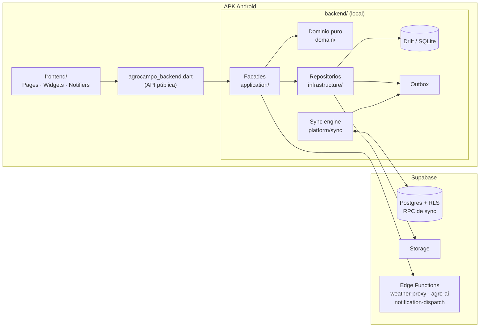
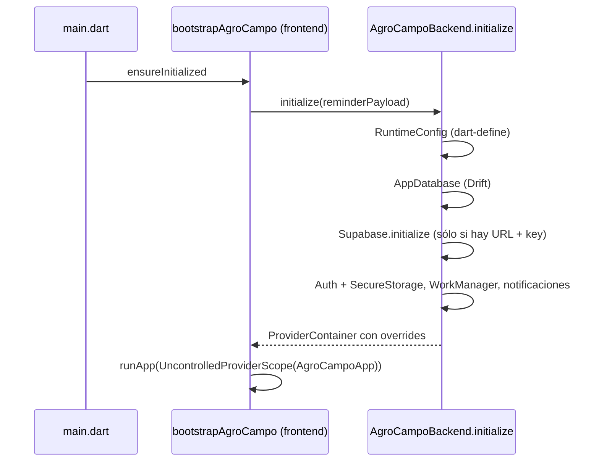
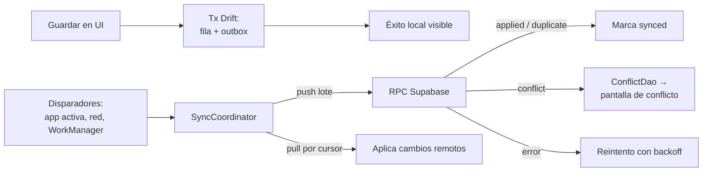

# AgroCampo: visión general y arquitectura

Documento de orientación para quien llega al repositorio. Resume qué es AgroCampo y cómo está
construido. No agrega requisitos: la autoridad funcional está en `specs/` y la visual en
[`master.md`](../../master.md). El detalle de imports y ownership está en
[`frontend-backend-boundary.md`](./frontend-backend-boundary.md).

## 1. Qué es

AgroCampo es una aplicación **Android personal y offline-first** para el agricultor propietario.
Reemplaza cuadernos y registros dispersos: organiza cuadrantes (sectores) y cultivos, registra las
`LABORES` de terreno, conserva historial por temporada y sincroniza con la nube cuando hay
conectividad. Todo guardado ocurre primero en el teléfono; la red nunca bloquea el trabajo de campo.

| Capacidad | Qué permite |
|---|---|
| Acceso y perfil | Sesión Supabase Auth persistida de forma segura, perfil, preferencias. |
| Territorio | Cuadrantes (sectores) del agricultor dibujados sobre mapa OpenStreetMap; sin parcelas desde 004. |
| Contexto agrícola | Selección del cuadrante activo, su temporada y su cultivo, que acompaña los registros. |
| Temporadas y cultivos | Ciclos de cultivo, catálogo oficial + cultivos propios, rotación por sector. |
| Labores | Registro de labores (fertilización, cosecha, etc.) ligado a sector y temporada. |
| Suelo | Mediciones de suelo como labor especializada. |
| Riego por goteo | Configuración del sector y cálculo explicado de riego. |
| Producción | Cosechas y rendimientos. |
| Apicultura | Inspecciones de colmenas por sector. |
| Fotografías | Fotos privadas asociadas a registros, subidas a Storage. |
| Recordatorios | Notificaciones locales programadas y push (FCM). |
| Historial | Proyección de lectura por sector y temporada. |
| Clima | Pronóstico y alertas vía Edge Function sobre Open-Meteo (auxiliar). |
| AgroIA | Chatbot agrícola general vía Gemini; sólo recibe el texto que el usuario envía (auxiliar). |
| Sincronización | Estado visible, cola pendiente y resolución explícita de conflictos. |
| Exportación | Exportación de datos a XLSX. |

Clima y AgroIA son auxiliares: si fallan, el resto de la app sigue funcionando.

### Fuentes de verdad

| Fuente | Autoridad |
|---|---|
| [`specs/001-agrocampo-android-mvp/`](../../specs/001-agrocampo-android-mvp/) | Definición del MVP: requisitos, plan, modelo de datos, contratos, backlog. |
| [`specs/002-agrocampo-functional-core/`](../../specs/002-agrocampo-functional-core/) | Incremento: núcleo funcional completo; redefine AgroIA sin contexto privado. |
| [`specs/003-agrocampo-functional-refinement/`](../../specs/003-agrocampo-functional-refinement/) | Incremento: flujos reales, persistentes y verificables sobre 001/002. |
| [`specs/004-sector-only-territory/`](../../specs/004-sector-only-territory/spec.md) | Elimina la parcela: cuadrantes por agricultor, temporadas por cuadrante y reinicio de datos (Drift v12, migración 0021). |
| [`master.md`](../../master.md) | Design System: única autoridad de UI/UX y accesibilidad. |
| `index.html`, `agrocampo-highfi.html` | Prototipos estáticos: sólo evidencia, nunca arquitectura ni alcance. |

## 2. Stack

| Capa | Tecnología |
|---|---|
| App | Flutter 3.47 / Dart 3.13, Android (minSdk 24, compileSdk 36), Material 3 |
| Estado e inyección | Riverpod 3 |
| Navegación | go_router |
| Persistencia local | Drift (SQLite), esquema v11 |
| Remoto | Supabase: Postgres + RLS + RPC, Auth, Storage, Edge Functions (Deno) |
| Segundo plano | workmanager (sync periódica), flutter_local_notifications, Firebase Messaging |
| Mapa | flutter_map + latlong2 sobre teselas OpenStreetMap |
| Otros | geolocator, image_picker, local_auth, flutter_secure_storage, excel |
| UI | Lucide icons, flutter_animate, tokens propios en `shared/design_system` |

## 3. Estructura del monorepo

Un único **Pub Workspace** (`pubspec.yaml` raíz) con dos miembros y un lockfile canónico.

```text
Agricultor-APP/
├── frontend/          # App Flutter ejecutable `agrocampo` (UI, navegación, estado de presentación)
│   ├── lib/src/app/       # bootstrap, router, shell de 5 pestañas, tema
│   ├── lib/src/modules/   # una carpeta por capacidad (presentation/)
│   ├── lib/src/shared/    # design_system: components, motion, semantics
│   ├── android/           # host nativo (también integraciones de backend)
│   ├── test/              # widget tests y goldens
│   └── integration_test/  # E2E en emulador/dispositivo
├── backend/           # Paquete Flutter `agrocampo_backend`, sin UI
│   ├── lib/agrocampo_backend.dart  # API pública (allowlist de <feature>_api.dart)
│   ├── lib/src/composition/        # bootstrap, providers, registro de codecs, scheduler
│   ├── lib/src/modules/            # contracts / application / domain / infrastructure
│   ├── lib/src/platform/           # database, sync, network, files, notifications, observability
│   ├── lib/src/shared/             # kernel y contratos estables
│   └── supabase/                   # migraciones SQL, RLS, Edge Functions, tests pgTAP
├── specs/             # requisitos 001, 002, 003
├── docs/              # arquitectura, despliegue, estado
├── scripts/           # run/build/secretos desde el .env de la raíz
├── tool/check_architecture.dart    # guard de fronteras
└── master.md          # Design System
```

El backend **no es un servidor**: es una librería local compilada dentro del APK. El único
servidor es Supabase.

## 4. Arquitectura

### 4.1 Vista general



Flujo canónico: **Frontend → Backend local → Drift → Outbox → Supabase**.

### 4.2 Frontera frontend / backend

- `frontend/lib/` sólo importa `package:agrocampo_backend/agrocampo_backend.dart`.
- Esa API reexporta facades, DTOs, entidades y value objects; **nunca** `AppDatabase`, DAOs,
  tablas Drift, `SupabaseClient`, outbox ni codecs.
- El backend no conoce widgets, rutas ni `go_router`. Para el deep link de recordatorios, el
  frontend inyecta una función que construye el payload.
- `tool/check_architecture.dart` valida estas reglas en CI (imports privados, ciclos entre
  módulos, dominio acoplado a frameworks, carpetas genéricas).

### 4.3 Módulos por capacidad (feature-first)

Ambos paquetes se organizan primero por capacidad y luego por capa:

| Frontend `modules/<feature>/` | Backend `modules/<feature>/` |
|---|---|
| `<feature>_ui.dart` (barrel entre módulos) | `<feature>_api.dart` (barrel público) |
| `presentation/pages`, `widgets`, `controllers`, `state`, `formatters` | `contracts/` (DTOs, inputs) |
| | `application/` (facades que coordinan) |
| | `domain/` (Dart puro: reglas, cálculos) |
| | `infrastructure/` (repositorios, tablas Drift, codecs de sync) |

Módulos: `agricultural_context`, `agro_ai`, `apiary`, `auth`, `crop_cycles`, `export`, `history`,
`irrigation`, `labors`, `media`, `production`, `profile`, `reminders`, `soil`, `sync_status`,
`territory`, `weather`. `home` existe sólo en frontend y compone las demás capacidades.

Ejemplo, riego:
`IrrigationFormController` (frontend) → `IrrigationFacade` → `IrrigationCalculator` /
`IrrigationRuleSet` (dominio) → `IrrigationRepository` (Drift + outbox) → codec de sync →
RPC Supabase.

Dependencias permitidas entre módulos backend: sólo vía `<feature>_api.dart` (por ejemplo,
`irrigation` y `production` consumen `LaborContextReader` de `labors`).

### 4.4 Arranque



Configuración en compilación (`--dart-define`, generada desde la sección `[APP]` del `.env` de la
raíz por `scripts/run_app.sh` y `scripts/build_android_release.sh`):

| Variable | Uso |
|---|---|
| `AGROCAMPO_ENV` | `development` (default), `staging`, `production`. |
| `AGROCAMPO_ONLINE` | Switch local/online. `false`: sin login ni Supabase (dueño local en `LocalAuthRepository`). `true` (default): Supabase; el primer login transfiere los datos locales con `OwnerTransfer`. |
| `SUPABASE_URL`, `SUPABASE_PUBLISHABLE_KEY` | Necesarias para el primer login y la sincronización; obligatorias en `production`. Después del primer login, la sesión guardada permite trabajar offline. |
| `MAP_INITIAL_LATITUDE`, `MAP_INITIAL_LONGITUDE`, `MAP_TILE_URL` | Centro y teselas del mapa. |

Los secretos de servidor (Gemini, cuenta de servicio Firebase) están en la sección `[FUNCTIONS]` del
mismo `.env` y sólo llegan a Supabase (`scripts/supabase_secrets.sh`); nunca al APK.

### 4.5 Persistencia y sincronización offline-first

Una sola base Drift (`backend/lib/src/platform/database/app_database.dart`). Las tablas de
negocio viven en cada módulo (`infrastructure/persistence/tables/`) y se componen con `part`;
es la única dependencia permitida `platform → modules`.

Invariantes del protocolo ([`sync-protocol.md`](../../specs/001-agrocampo-android-mvp/contracts/sync-protocol.md)):

1. Toda mutación queda durable en Drift **antes** de mostrar éxito.
2. Fila de dominio y operación de outbox se confirman en la misma transacción.
3. La UI lee siempre de Drift, nunca directo de remoto.
4. `operationId` es estable entre reintentos y reinicios (idempotencia).
5. Los conflictos nunca se resuelven en silencio ni por timestamp: se exponen al usuario.
6. La sincronización nunca bloquea navegación ni otros guardados.



Cada agregado tiene un codec en `modules/<owner>/infrastructure/sync/`, registrado en
`composition/sync_codec_composition.dart`. Los registros publican estado `pending`, `syncing`,
`synced`, `error` o `conflict`.

### 4.6 Supabase

| Elemento | Contenido |
|---|---|
| `migrations/0001`–`0020` | Perfil y RLS, territorio, labores, suelo, riego y reglas, producción, fotos, recordatorios, dispositivos, apicultura, protocolo de sync v2 y sus handlers por agregado. |
| `functions/weather-proxy` | Proxy autenticado a Open-Meteo. |
| `functions/agro-ai` | Chatbot con Gemini (`GEMINI_API_KEY` como secreto). |
| `functions/notification-dispatch` | Envío de push FCM. |
| `tests/` | pgTAP para RLS y RPC. |

Toda tabla está aislada por owner mediante RLS; el cliente usa sólo la publishable key.

### 4.7 Navegación y UI

Shell de cinco pestañas definido por `master.md` (`frontend/lib/src/app/routing/app_routes.dart`):

| Pestaña | Ruta | Contenido |
|---|---|---|
| Inicio | `/inicio` | Resumen del cuadrante activo, clima y perfil. |
| Sectores | `/sectores` | Mapa de cuadrantes, detalle, rotación, historial, apicultura. |
| Registrar | `/registrar` | Labores, suelo, riego, producción, foto. |
| AgroIA | `/agroia` | Chatbot. |
| Más | `/mas` | Temporadas, catálogo, historial, recordatorios, sincronización, exportar, configuración. |

Tema, tokens y componentes en `frontend/lib/src/app/theme/` y
`frontend/lib/src/shared/design_system/`; ningún literal visual fuera del tema.

## 5. Calidad y CI

| Nivel | Dónde |
|---|---|
| Unitarios / dominio / contratos | `backend/test/` |
| Widgets y goldens | `frontend/test/` |
| E2E Android (offline, sync, conflictos, recordatorios, mapa…) | `frontend/integration_test/` |
| SQL / RLS | `backend/supabase/tests/` (pgTAP) |
| Edge Functions | tests Deno por función |
| Prototipo | `node agrocampo-acceptance.test.js` |

Workflows en `.github/workflows/`: `ci.yml` (analyze, format, tests, architecture guard,
Supabase local), `android-integration.yml`, `android-release.yml` (APK debug y release firmado
cuando hay secretos) y `pages.yml` (prototipo en GitHub Pages). Detalle en [`deployment.md`](../deployment.md#6-cicd).

## 6. Cómo ejecutarla

```bash
flutter pub get                 # en la raíz (workspace)
cp .env.example .env            # Supabase es necesario para el primer login
./scripts/run_app.sh            # emulador o dispositivo
```

Requisitos y verificación: [`README.md`](../../README.md). Credenciales y despliegue:
[`deployment.md`](../deployment.md). Pendientes: [`status.md`](../status.md).
