# Pantallas de AgroCampo

Inventario visual de la app Android, pantalla por pantalla. Sirve como punto de partida para revisar
y cambiar la UI; la autoridad visual sigue siendo [`master.md`](../../master.md).

**Captura:** 2026-10-02 · Samsung Galaxy S21 Ultra (720×1600 lógicos) · build debug con
`AGROCAMPO_ONLINE=false` (modo local) · datos: una parcela "Frutillas" (Temuco) con un cuadrante sin
cultivo ni temporada, y 2 cambios pendientes. Se recortaron la barra de estado y la de navegación de
Android. La marca vertical delgada en el borde izquierdo de algunas capturas es el panel Edge de
Samsung, no la app.

Los hallazgos y su plan de corrección están en [`ISSUES.md`](./ISSUES.md).

Cada ficha indica: **ruta** (`go_router`), **propósito**, **CTA** (call to action principal),
**qué hace** y **qué debería mostrar** cuando hay datos. Las observaciones marcadas con ⚠️ están
resumidas en [Hallazgos](#hallazgos).

## Índice

| Pestaña | Pantallas |
|---|---|
| Inicio | [Inicio](#1-inicio) · [Perfil](#23-perfil) y subpantallas · [Parcelas](#32-parcelas) |
| Sectores | [Cuadrantes](#2-cuadrantes-sectores) · [Detalle de cuadrante](#3-detalle-de-cuadrante) · [Cultivos del sector](#4-cultivos-del-sector-rotación) · [Historial](#5-historial) · [Mapa](#6-mapa-de-cuadrantes) |
| Registrar | [Registrar labor](#7-registrar-labor) · [Riego](#8-riego) · [Riego por goteo](#9-riego-por-goteo-configuración) · [Suelo](#10-medición-de-suelo) · [Producción](#11-producción) · [Revisión apícola](#12-revisión-apícola) · [Fotografías](#13-fotografías) |
| AgroIA | [AgroIA](#14-agroia) |
| Más | [Más](#15-más) · [Temporadas](#16-temporadas) · [Nueva temporada](#17-nueva-temporada) · [Catálogo](#18-catálogo-de-cultivos) · [Recordatorios](#19-recordatorios) · [Sincronización](#20-sincronización) · [Exportar](#21-exportar) · [Configuración](#22-configuración) |

Todas las pantallas comparten la barra inferior de 5 pestañas y el banner global de estado de
conexión/sincronización bajo el encabezado.

---

## 1. Inicio

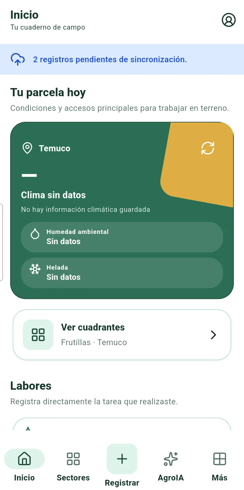 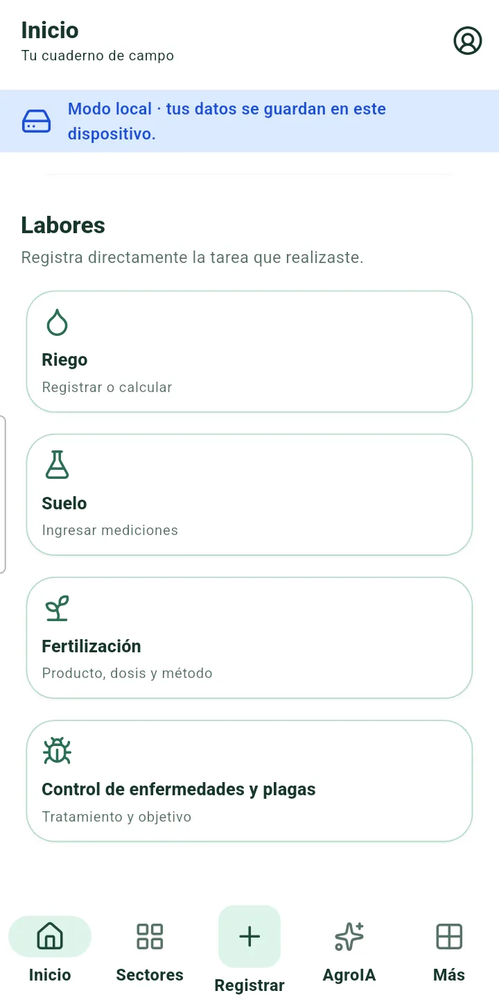

- **Ruta:** `/inicio`
- **Propósito:** resumen del día en la parcela activa y acceso rápido a las labores frecuentes.
- **CTA:** tarjetas de **Labores** (Riego, Suelo, Fertilización, Control de enfermedades y plagas) y
  **Ver cuadrantes**. Sin parcela: **Crear parcela**.
- **Qué hace:** muestra el clima de la localidad de la parcela, el acceso a los cuadrantes y abre cada
  formulario de labor con el contexto ya fijado. El ícono superior abre el Perfil.
- **Qué debería mostrar:** temperatura, humedad y riesgo de helada actualizados (online) o el último
  dato guardado con su antigüedad; sin parcela, el estado vacío "Crea tu primera parcela".
  ⚠️ En modo local el clima nunca se obtiene y la tarjeta queda en "Clima sin datos".

## 2. Cuadrantes (Sectores)

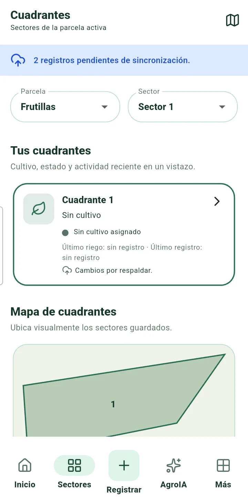

- **Ruta:** `/sectores`
- **Propósito:** ver los cuadrantes (sectores) de la parcela activa y su estado.
- **CTA:** tocar una **tarjeta de cuadrante**; ícono de mapa / **Mapa de cuadrantes**.
- **Qué hace:** selector de contexto (Parcela y Sector), lista de cuadrantes con cultivo, último riego
  y último registro, y una vista previa del mapa.
- **Qué debería mostrar:** cada cuadrante con su cultivo vigente, estado y actividad reciente; el
  indicador "Cambios por respaldar" mientras haya pendientes.

## 3. Detalle de cuadrante

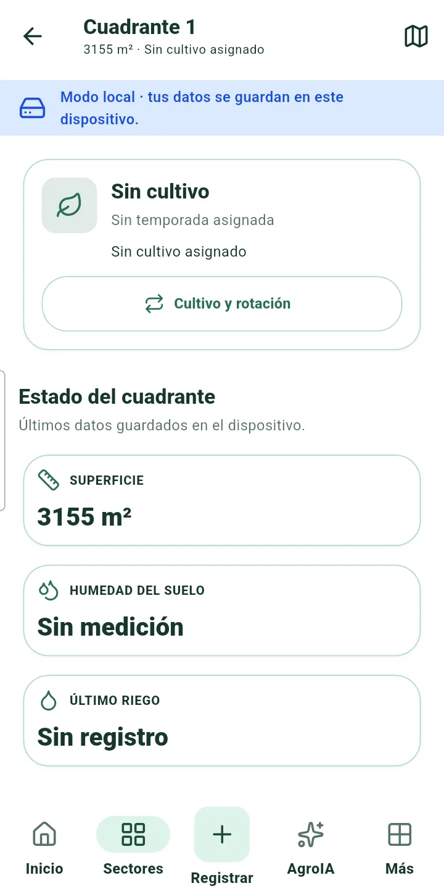 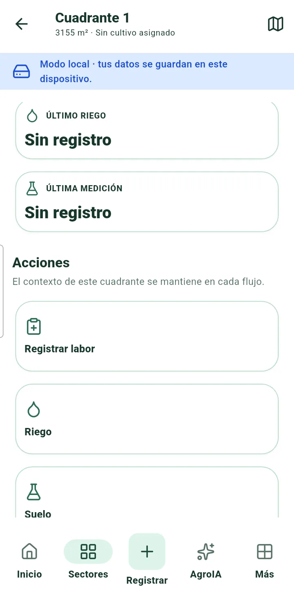 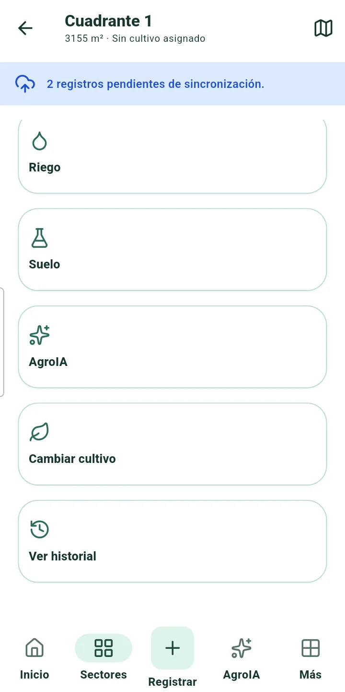

- **Ruta:** `/sectores/:id`
- **Propósito:** ficha del cuadrante con su cultivo, métricas y acciones.
- **CTA:** **Cultivo y rotación**; acciones **Registrar labor**, **Riego**, **Suelo**, **AgroIA**,
  **Cambiar cultivo**, **Ver historial**.
- **Qué hace:** muestra superficie, humedad del suelo, último riego y última medición, y abre cada flujo
  con el cuadrante como contexto. En cuadrantes de apicultura ofrece la revisión apícola.
- **Qué debería mostrar:** cultivo y temporada vigentes, y los últimos valores registrados en vez de
  "Sin registro".

## 4. Cultivos del sector (rotación)

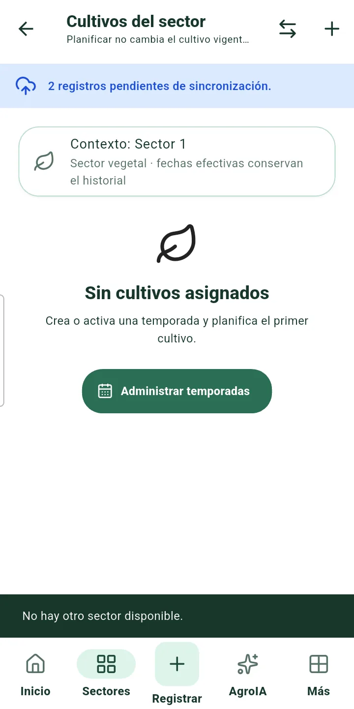 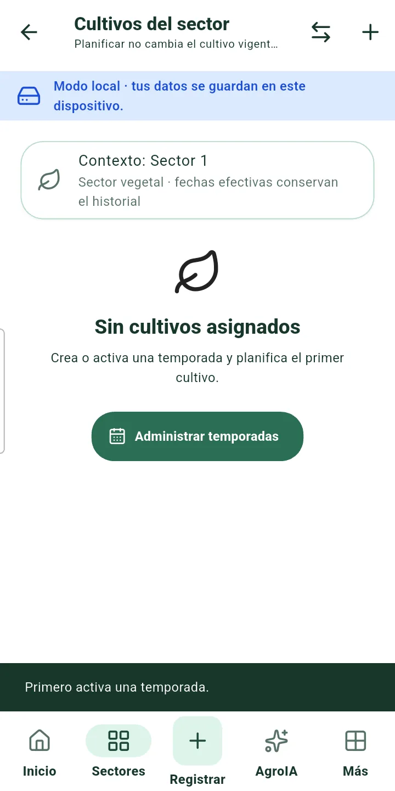

- **Ruta:** `/sectores/:id/rotacion`
- **Propósito:** planificar y cambiar el cultivo del cuadrante sin perder el historial.
- **CTA:** **+ Planificar cultivo**, **⇄ Intercambiar cultivos**; sin temporadas, **Administrar
  temporadas**.
- **Qué hace:** lista las asignaciones de cultivo con fechas efectivas. Planificar exige una temporada
  activa (la segunda captura muestra el aviso "Primero activa una temporada.").
- **Qué debería mostrar:** cultivo vigente y planificados con su vigencia; el intercambio entre dos
  sectores cuando existe más de uno.

## 5. Historial

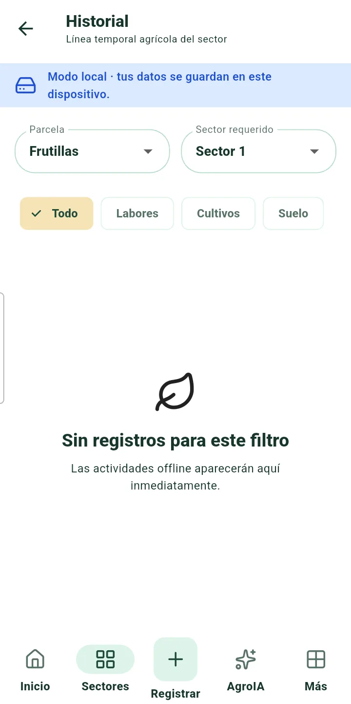

- **Ruta:** `/sectores/:id/historial` y `/mas/historial` (misma pantalla).
- **Propósito:** línea temporal agrícola del sector.
- **CTA:** filtros **Todo / Labores / Cultivos / Suelo**.
- **Qué hace:** lista labores, cambios de cultivo y mediciones del sector seleccionado, incluidos los
  registros offline.
- **Qué debería mostrar:** eventos en orden cronológico con su fecha, tipo y estado de respaldo.

## 6. Mapa de cuadrantes

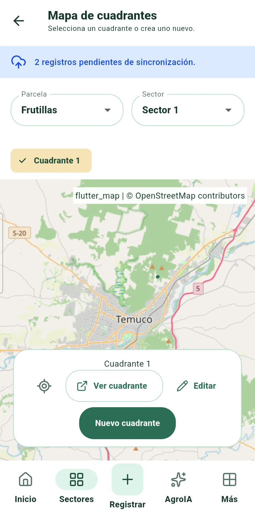 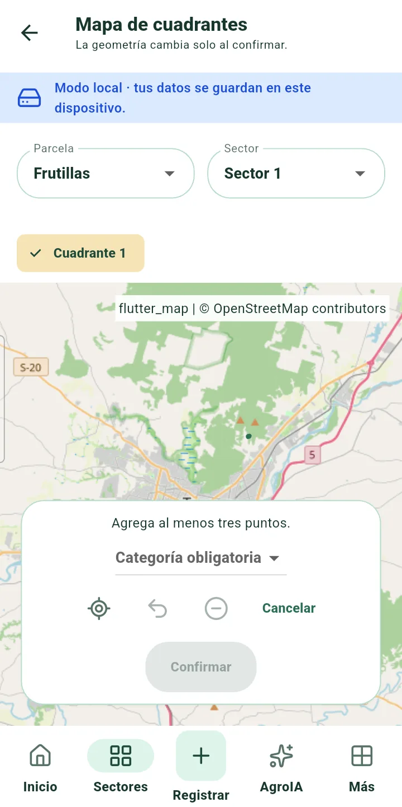

- **Ruta:** `/sectores/parcela/:parcelId/mapa`
- **Propósito:** ubicar y dibujar los cuadrantes sobre el mapa (OpenStreetMap).
- **CTA:** **Nuevo cuadrante**; con uno seleccionado, **Ver cuadrante** y **Editar**; **Usar mi
  ubicación**.
- **Qué hace:** en modo dibujo se agregan puntos tocando el mapa (mínimo tres), se elige la
  **Categoría obligatoria** y se **Confirma**; **Deshacer**, **Quitar último punto** y **Cancelar**.
  La geometría sólo cambia al confirmar.
- **Qué debería mostrar:** los polígonos de todos los cuadrantes; si el mapa no carga, la lista textual
  de cuadrantes sigue disponible.

## 7. Registrar labor

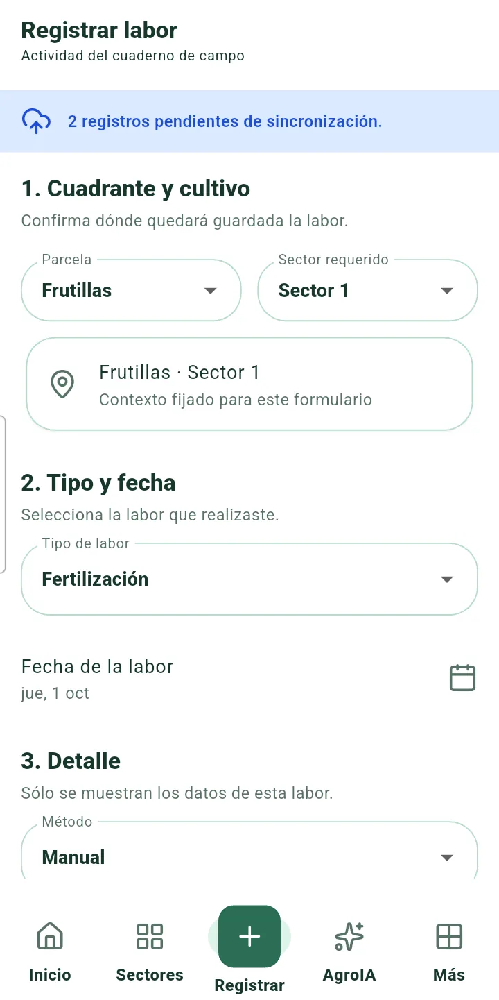 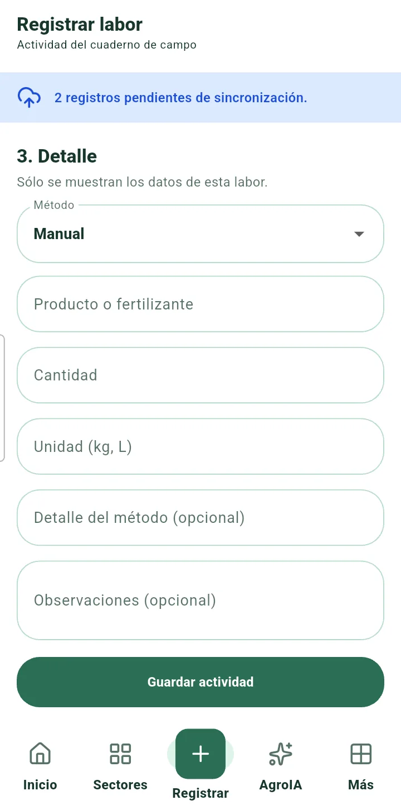 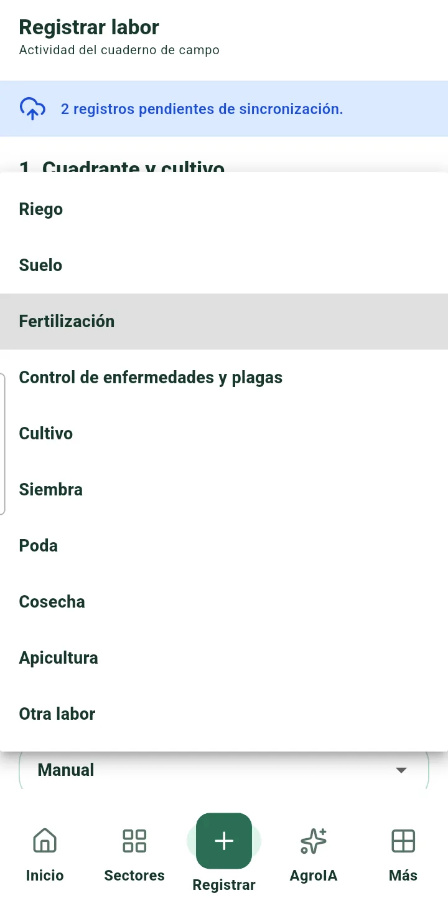

- **Ruta:** `/registrar` y `/registrar/labor/:tipo`
- **Propósito:** registrar cualquier labor del cuaderno de campo en tres pasos.
- **CTA:** **Guardar actividad**; algunos tipos derivan a su flujo especializado.
- **Qué hace:** 1) confirma parcela y sector; 2) tipo y fecha; 3) muestra sólo los campos del tipo
  elegido. Tipos: Riego, Suelo, Fertilización, Control de enfermedades y plagas, Cultivo, Siembra,
  Poda, Cosecha, Apicultura y Otra labor.
- **Qué debería mostrar:** después de guardar, confirmación de guardado local y la labor en el
  historial.

Variantes del paso "3. Detalle":

| Tipo | Campos | CTA | Captura |
|---|---|---|---|
| Fertilización | Método, Producto o fertilizante, Cantidad, Unidad, Detalle del método, Observaciones | Guardar actividad | [07_registrar_b](07_registrar_b.webp) |
| Control de enfermedades y plagas | Producto, Plaga o enfermedad objetivo, Dosis, Unidad, Días de carencia, Observaciones | Guardar actividad | [07_registrar_plagas](07_registrar_plagas.webp) |
| Cultivo | Labor realizada, Estado observado, Variedad, Observaciones | Guardar actividad | [07_registrar_cultivo](07_registrar_cultivo.webp) |
| Siembra | Cantidad de semilla, Unidad, Distancia entre plantas, Observaciones | Guardar actividad | [07_registrar_siembra](07_registrar_siembra.webp) |
| Poda | Método de poda, Plantas intervenidas, Observaciones | Guardar actividad | [07_registrar_poda](07_registrar_poda.webp) |
| Otra labor | Nombre de la labor, Descripción, Observaciones | Guardar actividad | [07_registrar_otra](07_registrar_otra.webp) |
| Cosecha | Aviso: se registra junto con la producción | **Registrar cosecha y producción** → [Producción](#11-producción) | [07_registrar_cosecha](07_registrar_cosecha.webp) |
| Apicultura | Observaciones | **Abrir revisión apícola** → [Revisión apícola](#12-revisión-apícola) | [07_registrar_apicultura](07_registrar_apicultura.webp) |
| Riego / Suelo | — | Derivan a [Riego](#8-riego) y [Suelo](#10-medición-de-suelo) | — |

## 8. Riego

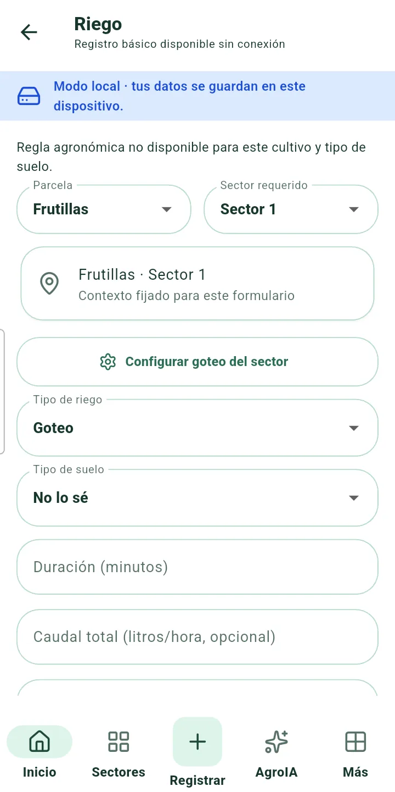 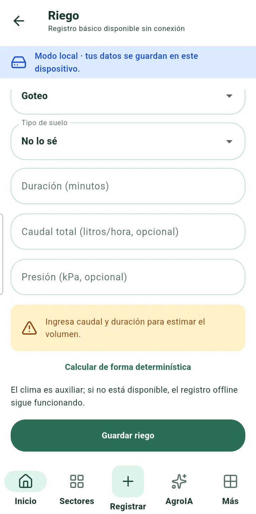

- **Ruta:** `/registrar/riego`
- **Propósito:** registrar un riego y estimar su volumen.
- **CTA:** **Guardar riego**; secundarios **Calcular de forma determinística** y **Configurar goteo del
  sector**.
- **Qué hace:** con duración y caudal estima el volumen; usa la configuración de goteo del sector. Si
  no hay regla agronómica para el cultivo y suelo, lo avisa y permite el registro básico.
- **Qué debería mostrar:** tipo de riego y suelo legibles, y el volumen estimado con su explicación.
  ⚠️ Los selectores muestran valores internos en inglés: `drip` y `unknown`.

## 9. Riego por goteo (configuración)

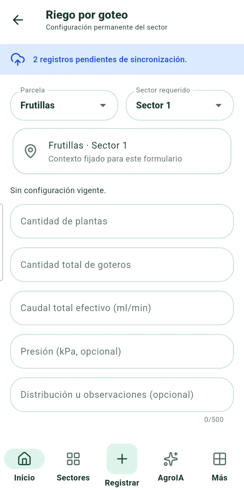 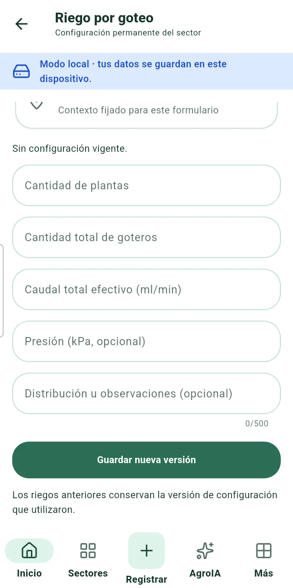

- **Ruta:** `/registrar/riego/configuracion`
- **Propósito:** configuración permanente del goteo del sector.
- **CTA:** **Guardar nueva versión**.
- **Qué hace:** guarda cantidad de plantas, goteros, caudal total efectivo, presión y notas como una
  versión nueva; los riegos anteriores conservan la versión que usaron.
- **Qué debería mostrar:** la configuración vigente (hoy "Sin configuración vigente.").

## 10. Medición de suelo

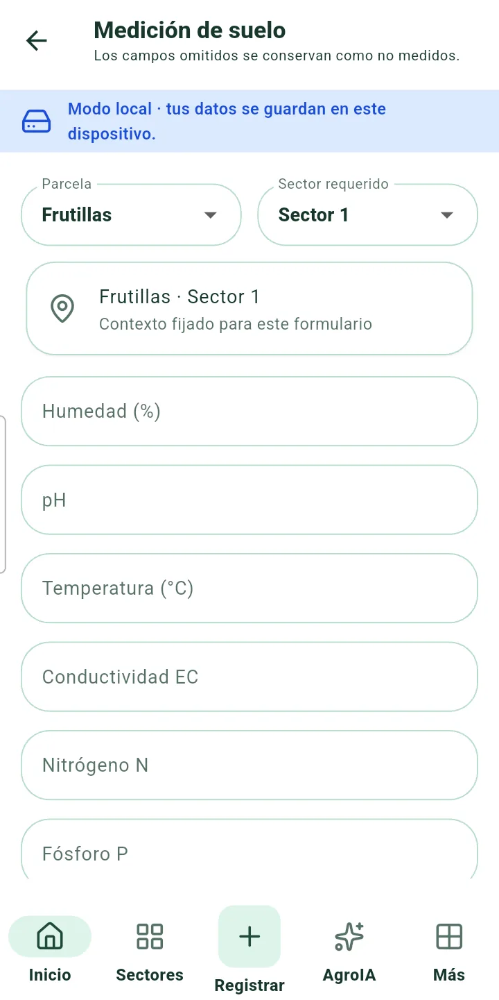 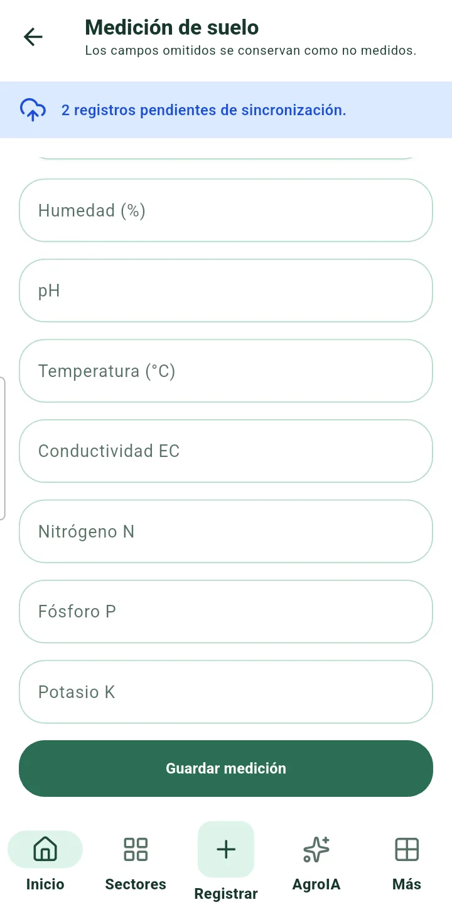

- **Ruta:** `/registrar/suelo`
- **Propósito:** registrar una medición de suelo.
- **CTA:** **Guardar medición**.
- **Qué hace:** captura humedad, pH, temperatura, conductividad EC, N, P y K; los campos vacíos quedan
  como "no medidos".
- **Qué debería mostrar:** tras guardar, la medición en el detalle del cuadrante y en el historial.

## 11. Producción

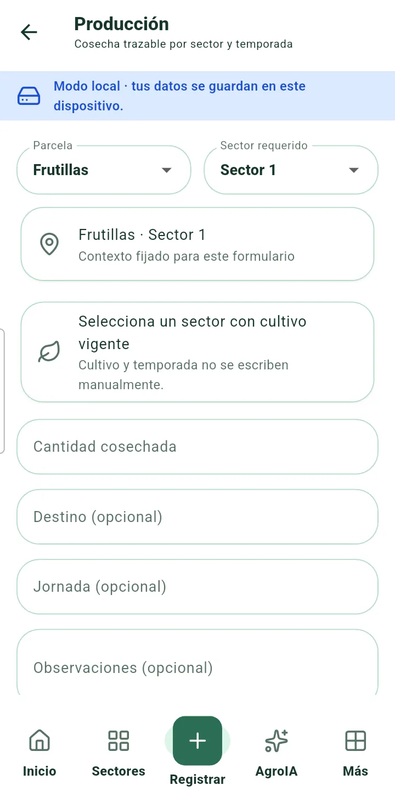 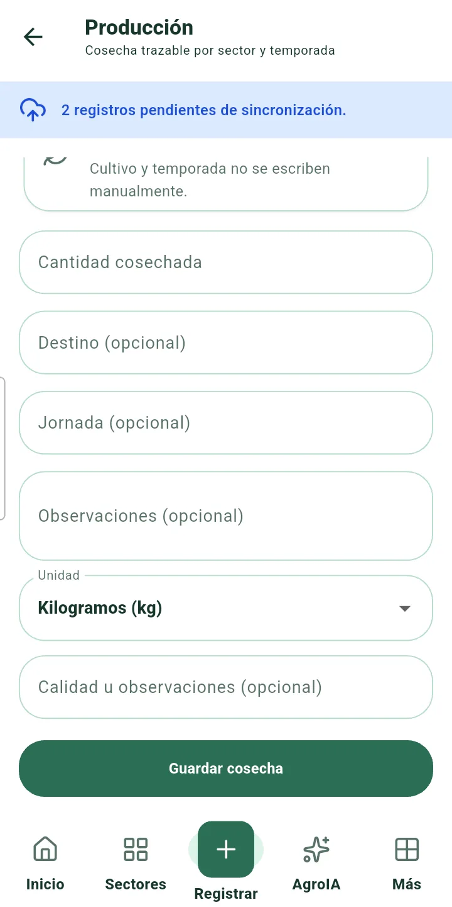

- **Ruta:** `/registrar/produccion` (desde Registrar labor → Cosecha)
- **Propósito:** registrar una cosecha trazable por sector y temporada.
- **CTA:** **Guardar cosecha**.
- **Qué hace:** captura cantidad, unidad, destino, jornada y calidad; cultivo y temporada se toman del
  sector, no se escriben.
- **Qué debería mostrar:** el cultivo y la temporada vigentes del sector. Sin cultivo vigente muestra
  "Selecciona un sector con cultivo vigente", como en la captura.

## 12. Revisión apícola

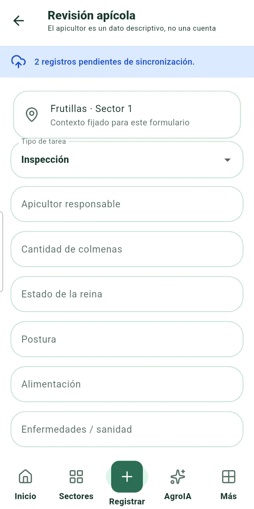 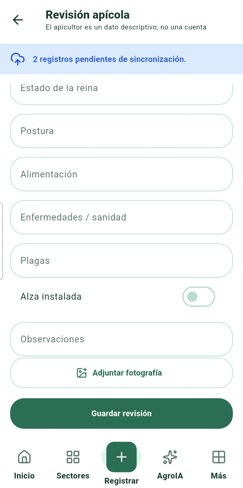

- **Ruta:** `/sectores/:id/apicultura` (desde Registrar labor → Apicultura o desde un cuadrante
  apícola)
- **Propósito:** registrar una revisión de colmenas.
- **CTA:** **Guardar revisión**; secundario **Adjuntar fotografía**.
- **Qué hace:** tipo de tarea, apicultor responsable (texto, no cuenta), cantidad de colmenas, estado
  de la reina, postura, alimentación, sanidad, plagas, alza instalada y observaciones.
- **Qué debería mostrar:** sólo para cuadrantes de categoría apícola.
  ⚠️ Se pudo abrir sobre un cuadrante de frutillas.

## 13. Fotografías

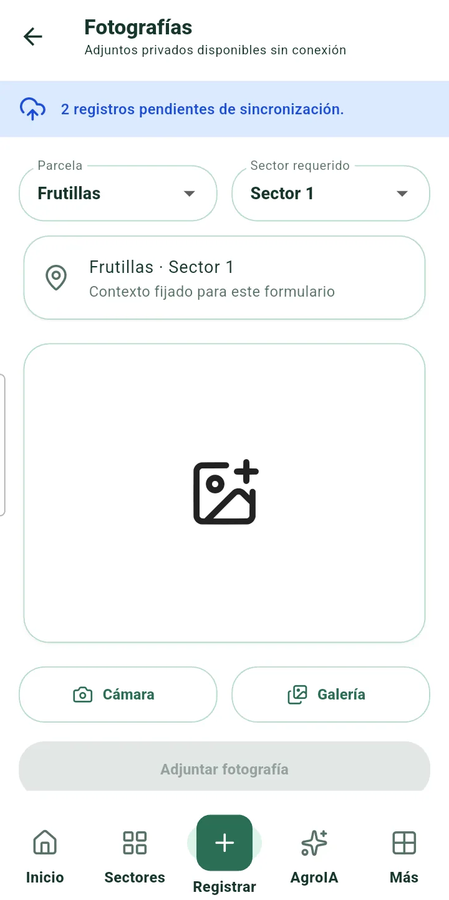

- **Ruta:** `/registrar/foto` (desde Revisión apícola)
- **Propósito:** adjuntar fotos privadas al registro.
- **CTA:** **Cámara** / **Galería**, luego **Adjuntar fotografía** (deshabilitado hasta elegir una).
- **Qué hace:** guarda la foto en el dispositivo y la sube a Storage al sincronizar.
- **Qué debería mostrar:** la vista previa de la foto elegida y el estado de respaldo.

## 14. AgroIA

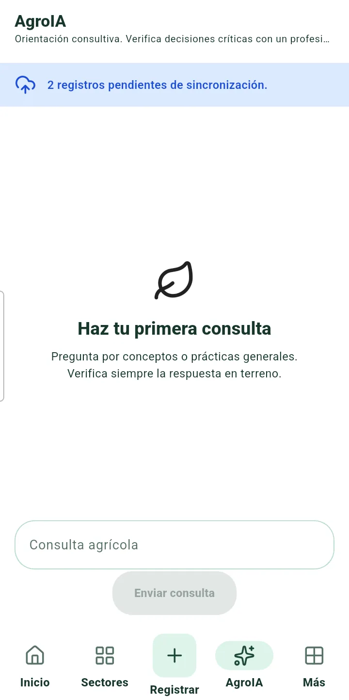

- **Ruta:** `/agroia`
- **Propósito:** chatbot agrícola consultivo.
- **CTA:** **Enviar consulta** (deshabilitado sin texto).
- **Qué hace:** envía sólo el texto escrito; no recibe datos de la parcela ni escribe registros.
- **Qué debería mostrar:** la conversación con estado por mensaje y **Reintentar** en los fallidos.
  ⚠️ En modo local invita a "Haz tu primera consulta" aunque AgroIA no está disponible.

## 15. Más

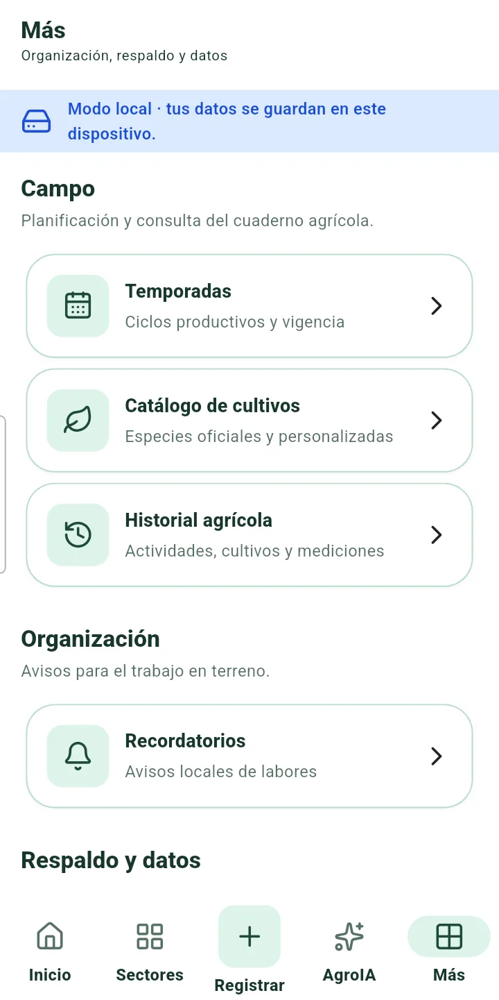 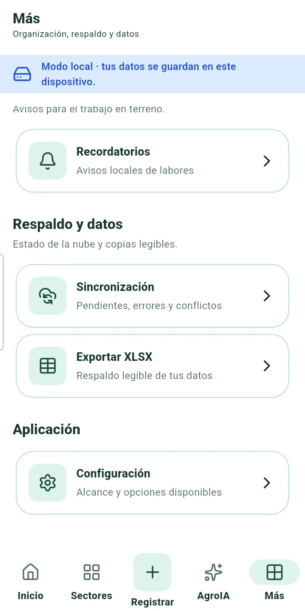

- **Ruta:** `/mas`
- **Propósito:** menú de organización, respaldo y configuración.
- **CTA:** Temporadas, Catálogo de cultivos, Historial agrícola, Recordatorios, Sincronización,
  Exportar XLSX y Configuración.

## 16. Temporadas

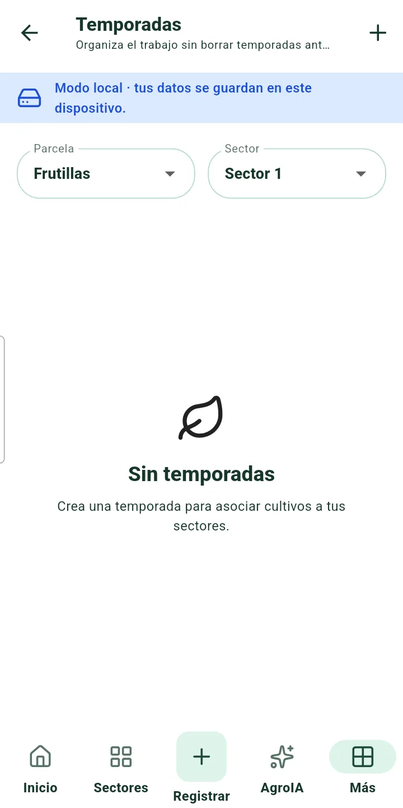

- **Ruta:** `/mas/temporadas`
- **Propósito:** ciclos productivos de la parcela.
- **CTA:** **+ Nueva temporada**; tocar una temporada para editarla.
- **Qué debería mostrar:** temporadas con su estado (planificada, activa, cerrada) y vigencia; hoy el
  estado vacío "Sin temporadas".

## 17. Nueva temporada

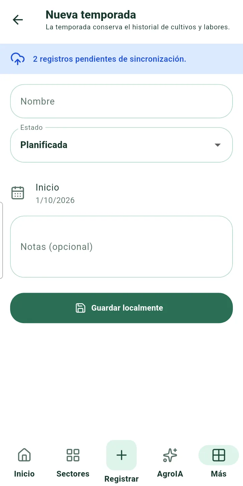

- **Ruta:** `/mas/temporadas/nueva` y `/mas/temporadas/:id/editar`
- **Propósito:** crear o editar una temporada.
- **CTA:** **Guardar localmente**.
- **Qué hace:** nombre, estado, fecha de inicio y notas.

## 18. Catálogo de cultivos

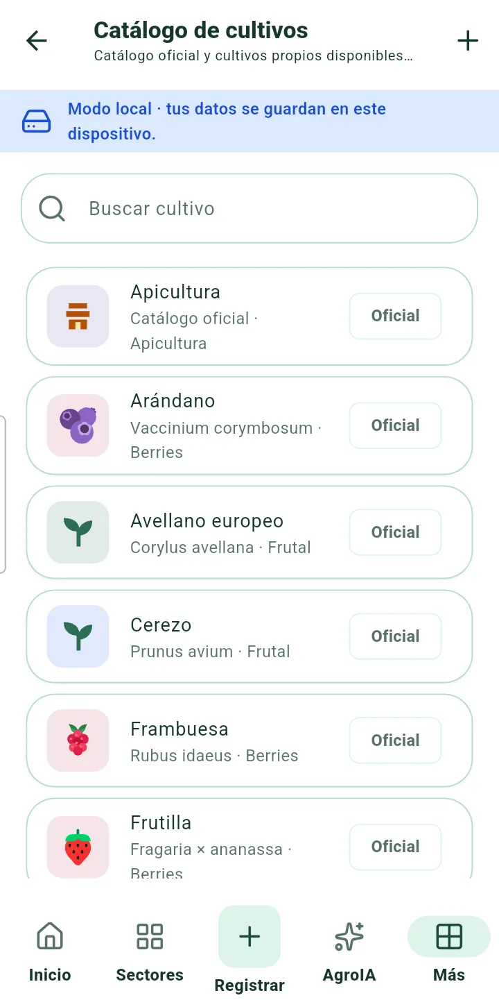 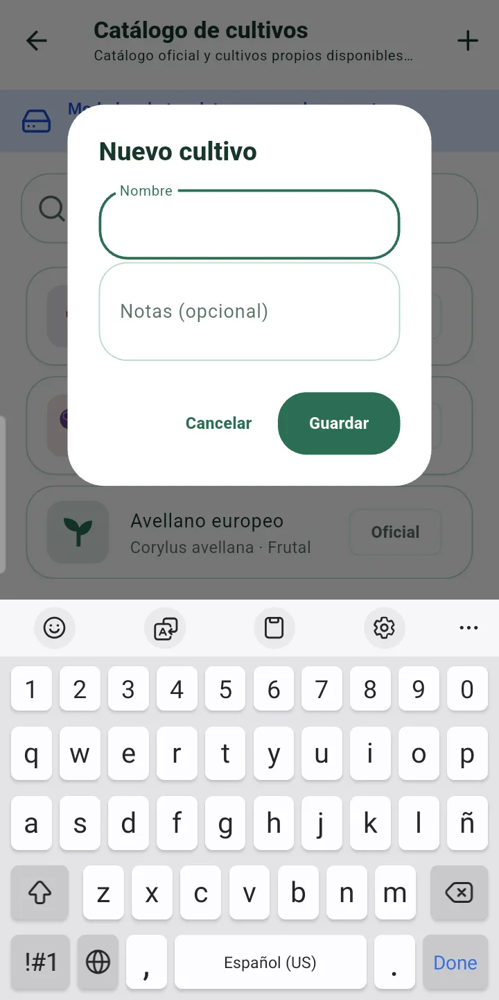

- **Ruta:** `/mas/catalogo`
- **Propósito:** especies oficiales y cultivos propios, disponibles sin Internet.
- **CTA:** **+ Crear cultivo personalizado** (diálogo "Nuevo cultivo": Nombre, Notas → **Guardar**);
  buscador.
- **Qué debería mostrar:** cada cultivo con nombre común, científico y tipo.
  ⚠️ El tipo mezcla idiomas: "berry" junto a "frutal".

## 19. Recordatorios

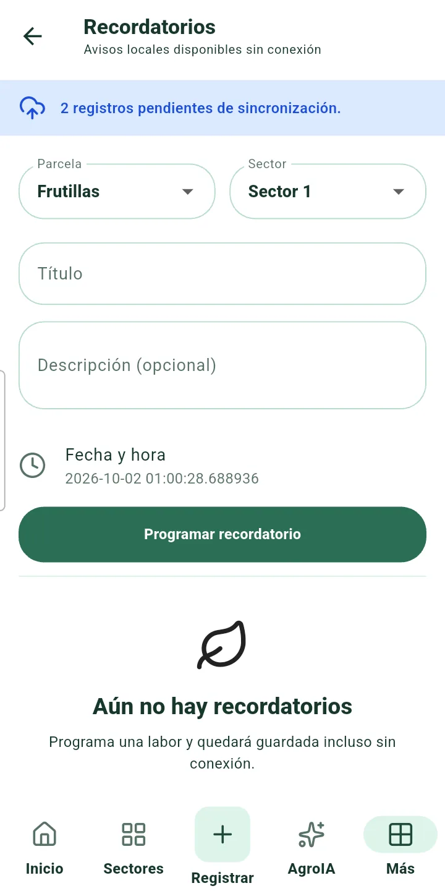

- **Ruta:** `/mas/recordatorios` (y `/mas/recordatorios/:id`)
- **Propósito:** avisos locales de labores.
- **CTA:** **Programar recordatorio**.
- **Qué hace:** título, descripción y fecha/hora en el contexto activo; la notificación funciona sin
  conexión.
- **Qué debería mostrar:** la lista de recordatorios con su estado y menú en los programados.
  ⚠️ La fecha aparece sin formato: `2026-10-02 01:00:28.688936`.

## 20. Sincronización

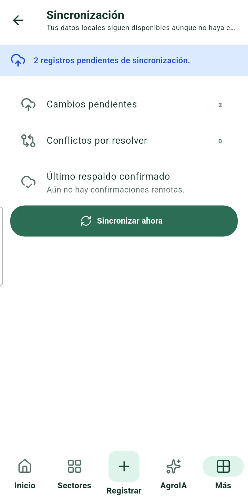

- **Ruta:** `/mas/sincronizacion` (conflictos en `/mas/sincronizacion/conflictos/:id`)
- **Propósito:** estado del respaldo en la nube.
- **CTA:** **Sincronizar ahora**.
- **Qué hace:** cambios pendientes, conflictos por resolver y último respaldo confirmado.
- **Qué debería mostrar:** en modo online, la fecha del último respaldo y los conflictos con acceso a
  su resolución. ⚠️ En modo local ofrece "Sincronizar ahora" aunque no hay nube.

## 21. Exportar

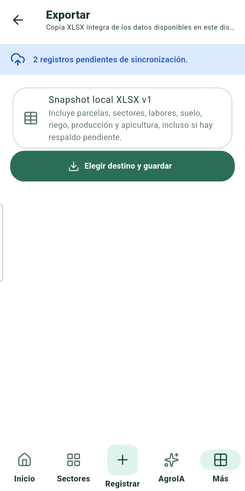

- **Ruta:** `/mas/exportar`
- **Propósito:** copia legible (XLSX) de todos los datos del dispositivo.
- **CTA:** **Elegir destino y guardar**.

## 22. Configuración

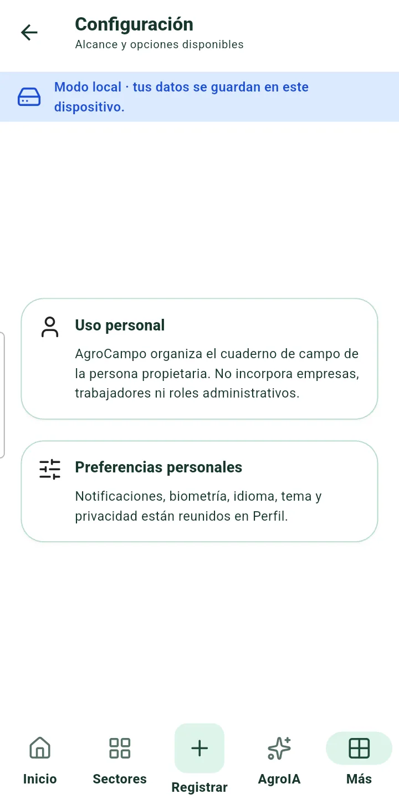

- **Ruta:** `/mas/configuracion`
- **Propósito:** explica el alcance (uso personal) y remite las preferencias a Perfil.
- **CTA:** ninguno; es informativa.

## 23. Perfil

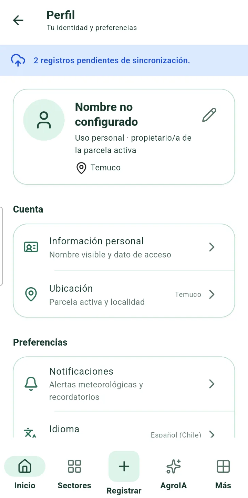 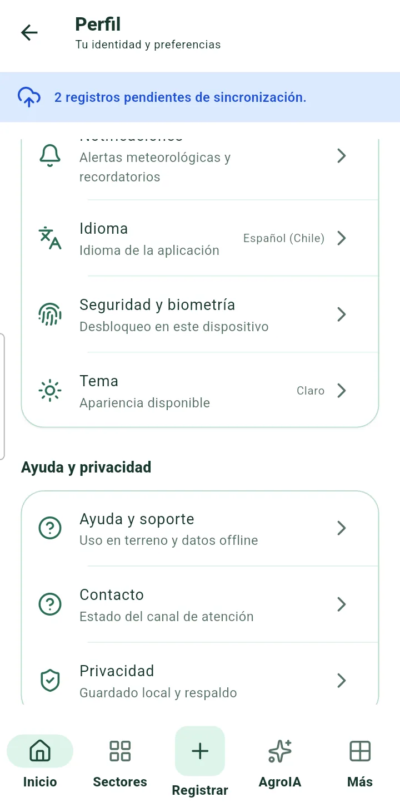 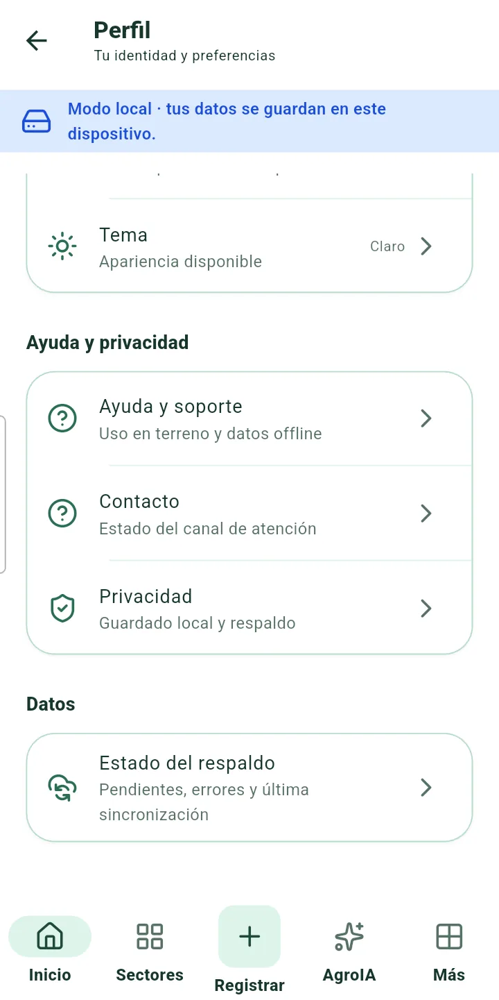

- **Ruta:** `/inicio/perfil`
- **Propósito:** identidad y preferencias del agricultor.
- **CTA:** **Editar información personal** (lápiz) y cada fila de ajustes. En modo online incluye
  **Cerrar sesión**; en modo local se oculta.
- **Qué debería mostrar:** nombre visible configurado (hoy "Nombre no configurado").

| # | Subpantalla | Ruta | Contenido / CTA | Captura |
|---|---|---|---|---|
| 24 | Información personal | `/inicio/perfil/informacion` | Nombre visible y correo de acceso → **Guardar cambios** | [24](24_perfil_informacion.webp) |
| 25 | Notificaciones | `/inicio/perfil/notificaciones` | Interruptor de alertas meteorológicas; recordatorios se gestionan en Más | [25](25_perfil_notificaciones.webp) |
| 26 | Idioma | `/inicio/perfil/idioma` | Sólo Español (Chile); informativa | [26](26_perfil_idioma.webp) |
| 27 | Seguridad | `/inicio/perfil/seguridad` | Interruptor de desbloqueo biométrico | [27](27_perfil_seguridad.webp) |
| 28 | Tema | `/inicio/perfil/tema` | Sólo modo claro; informativa | [28](28_perfil_tema.webp) |
| 29 | Ayuda y soporte | `/inicio/perfil/ayuda` | Preguntas frecuentes de uso en terreno | [29](29_perfil_ayuda.webp) |
| 30 | Contacto | `/inicio/perfil/contacto` | "Contacto no configurado" | [30](30_perfil_contacto.webp) |
| 31 | Privacidad | `/inicio/perfil/privacidad` | Resumen de guardado local y respaldo | [31](31_perfil_privacidad.webp) |

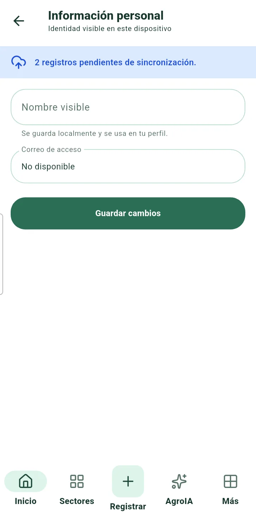 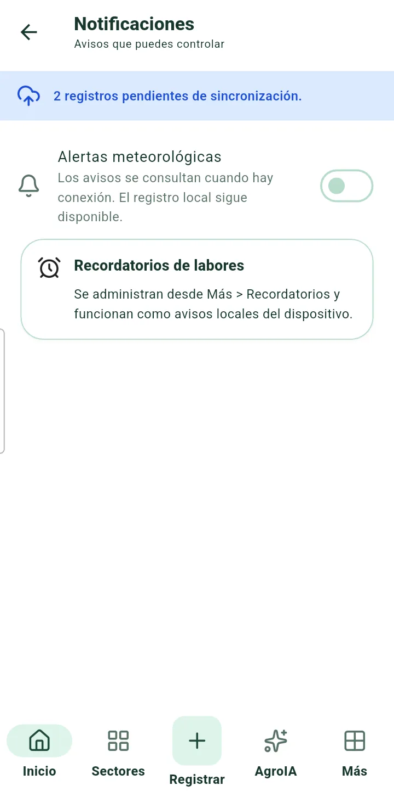 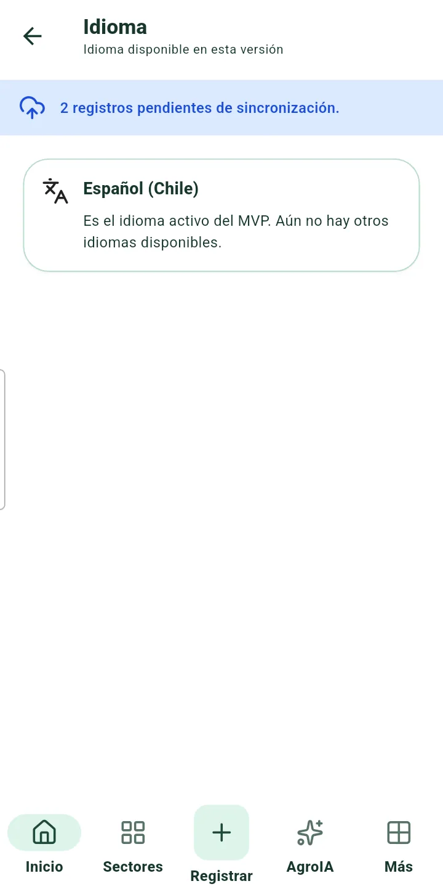 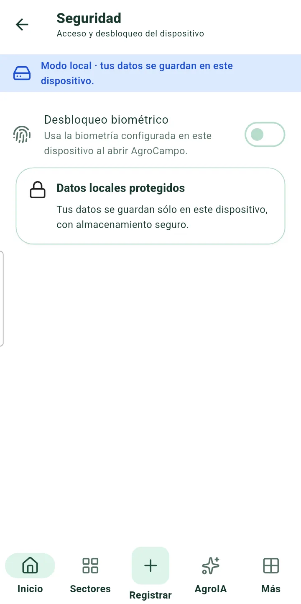 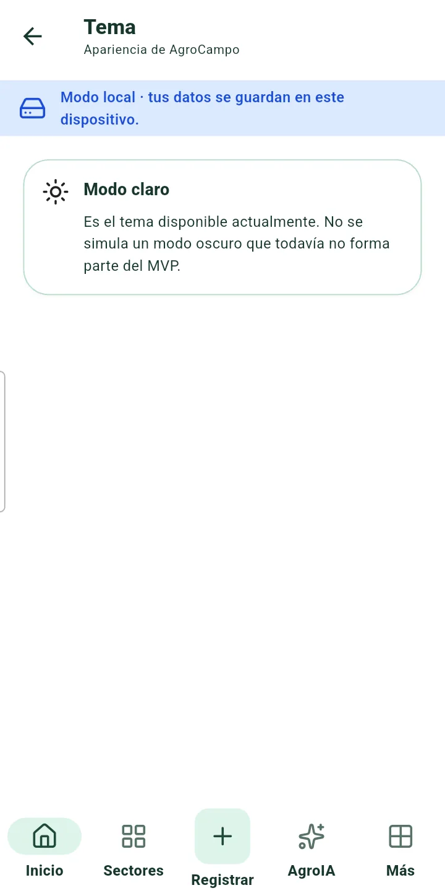 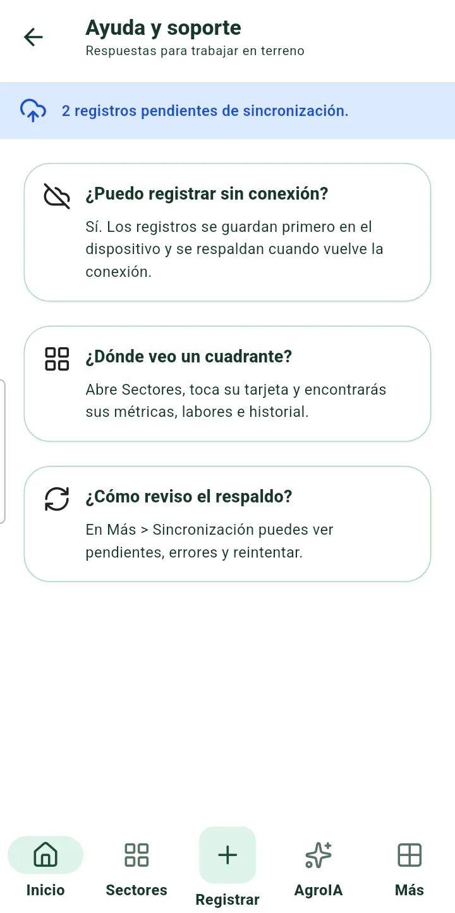 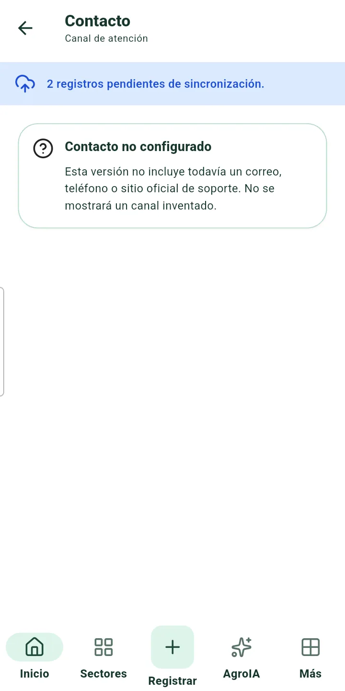 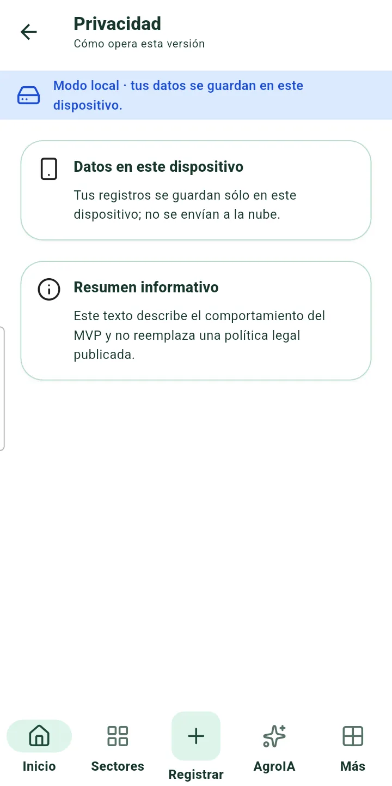

## 32. Parcelas

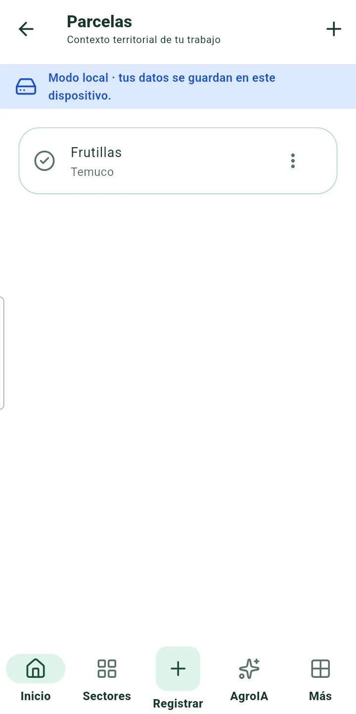 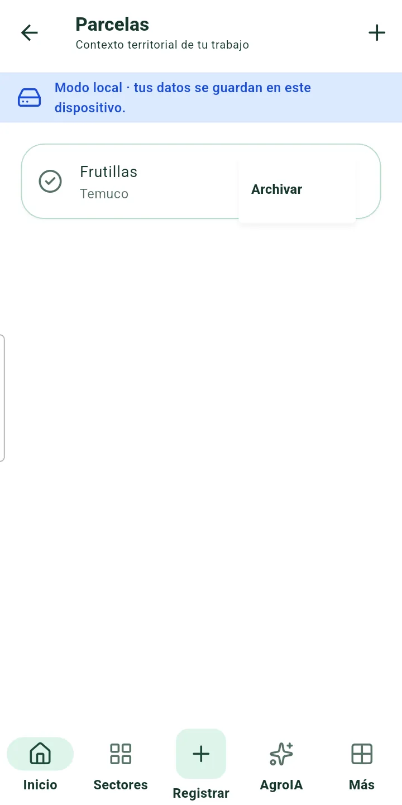 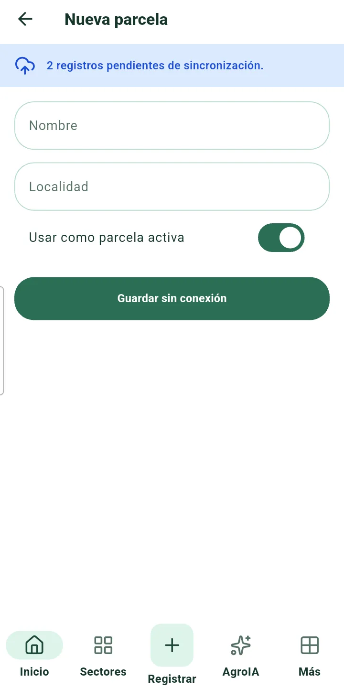 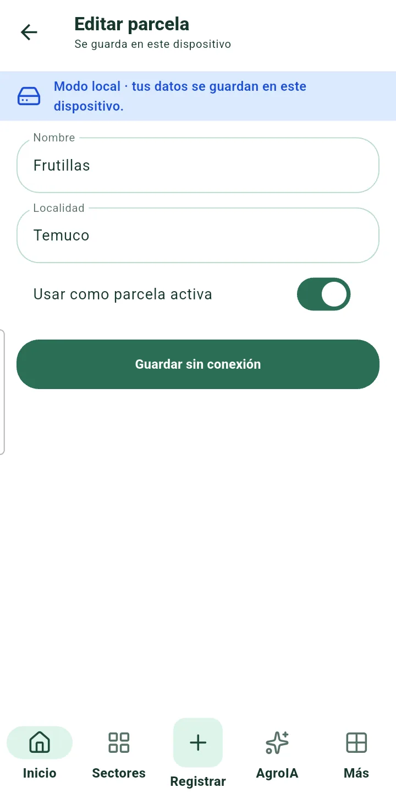

- **Ruta:** `/inicio/parcelas`, `/inicio/parcelas/nueva`, `/inicio/parcelas/:id/editar` (desde Perfil
  → Ubicación)
- **Propósito:** administrar parcelas.
- **CTA:** **+ Nueva parcela**; tocar una parcela para editarla; menú **⋮ → Archivar**. En el
  formulario: Nombre, Localidad, **Usar como parcela activa** → **Guardar sin conexión**.
- **Qué debería mostrar:** todas las parcelas, marcando la activa.
  ⚠️ Usan un encabezado distinto al resto (sin subtítulo y con otro alto).

## Pantallas no capturadas

| Pantalla | Ruta | Motivo |
|---|---|---|
| Acceso (login) | `/acceso` | Sólo existe en modo online (`AGROCAMPO_ONLINE=true`). |
| Resolución de conflicto | `/mas/sincronizacion/conflictos/:id` | Requiere un conflicto real de sincronización. |

## Hallazgos

Observados durante la captura; ninguno se corrigió todavía.

| # | Pantalla | Hallazgo |
|---|---|---|
| 1 | Todas | En modo local, el banner global sigue diciendo "N registros pendientes de sincronización." aunque nunca se sincronizará. |
| 2 | Riego | Los selectores muestran valores internos en inglés (`drip`, `unknown`). |
| 3 | Recordatorios | La fecha y hora se muestran sin formato (`2026-10-02 01:00:28.688936`). |
| 4 | Catálogo | El tipo de cultivo mezcla idiomas ("berry" junto a "frutal"). |
| 5 | AgroIA, Sincronización, Inicio (clima) | En modo local invitan a usar funciones no disponibles (consultar, sincronizar, actualizar clima). |
| 6 | Seguridad, Privacidad | En modo local mencionan "Cerrar sesión", Supabase y "datos por cuenta", que no aplican. |
| 7 | Parcelas | Encabezado distinto al de `AgroPage` usado en el resto de la app. |
| 8 | Revisión apícola | Accesible sobre un cuadrante de cultivo vegetal. |
