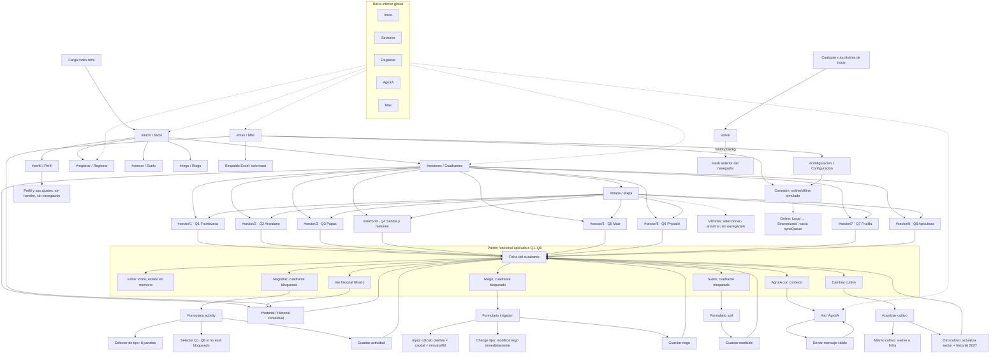

# Jerarquía funcional de `index.html`

## Alcance

Este documento describe exclusivamente el funcionamiento implementado en `index.html`: rutas hash, pantallas, botones, formularios, selectores, acciones, estado en memoria, navegación y retornos. No describe CSS, colores, tipografías, composición visual ni calidad gráfica.

La implementación es un prototipo estático. El comportamiento se concentra en el estado JavaScript global, las funciones que generan cada pantalla y los listeners de `click`, `change`, `input`, `submit`, `pointerdown`, `pointermove`, `pointerup` y `hashchange` (`index.html:149-295`).

## 1. Estado funcional y persistencia

El objeto `state` es la única fuente de estado durante la sesión actual del navegador. Incluye:

- `route`: ruta hash actual.
- `online`: modo de conexión simulado; inicia en `true`.
- `selectedSectorId`: cuadrante contextual; inicia en `1`.
- `selectedIrrigationType`: tipo de riego usado como valor inicial del selector; inicia en `goteo`.
- `selectedActivityType`: actividad preseleccionada del formulario Registrar; inicia en `Suelo`.
- `actionSectorLocked`: indica si Registrar, Suelo o Riego deben conservar bloqueado el cuadrante desde el que se abrió la acción.
- `soilDraft`: valores globales del último formulario de suelo (`pH`, humedad, temperatura, conductividad, N, P, K y fertilidad).
- `alerts`: arreglo inicial vacío; no es consumido por una pantalla porque `alertBanner()` devuelve vacío.
- `weather`: datos estáticos del clima que se muestran en Inicio y en las fichas.
- `chatMessages`: conversación de AgroIA en memoria.
- `sectors`: los ocho cuadrantes y sus datos actuales.
- `mapSections`: ocho geometrías con cuatro vértices editables cada una y coordenadas GPS iniciales.
- `activities`: historial simulado de actividades.
- `irrigationSessions`: datos iniciales que no son consumidos por ninguna pantalla interactiva.
- `syncQueue`: identificadores de cambios creados en modo offline y todavía no sincronizados.

No se usa `localStorage`, `sessionStorage`, IndexedDB, backend, API ni descarga de archivos. Por tanto, “guardar”, “sincronizar” y “exportar” son simulaciones en memoria y se pierden al recargar la página.

### Contexto del cuadrante seleccionado

`sector(id)` busca por ID y, si no encuentra coincidencia, devuelve el Cuadrante 1. Muchas pantallas usan `sector()` sin recibir un ID directo; por ello dependen de `state.selectedSectorId`:

- AgroIA responde con el nombre, cultivo, humedad global y riego del cuadrante seleccionado.
- Historial filtra `state.activities` por el cuadrante seleccionado.
- Formularios abiertos desde una ficha conservan ese cuadrante mediante `actionSectorLocked`.
- Formularios abiertos desde Inicio, la barra inferior o una ruta general permiten cambiar el cuadrante, salvo que el usuario haya llegado desde una acción de ficha que lo bloquee.

## 2. Mapa general de navegación

La ruta se guarda en `location.hash`. `setRoute(route)` asigna el hash y `window.hashchange` vuelve a ejecutar `render()`. Si la página se abre sin hash, `render()` reemplaza la URL actual por `#inicio` usando `history.replaceState`.

```text
Inicio (#inicio)
├── Perfil (#perfil)
├── Ver cuadrantes (#sectores)
│   ├── Cuadrante 1..8 (#sector/1 ... #sector/8)
│   │   ├── Registrar (#registrar, cuadrante bloqueado)
│   │   ├── Riego (#riego, cuadrante bloqueado)
│   │   ├── Suelo (#sensor, cuadrante bloqueado)
│   │   ├── AgroIA (#ia, con contexto del cuadrante)
│   │   ├── Cambiar cultivo (#cambiar-cultivo)
│   │   └── Ver historial (#historial, filtrado por cuadrante)
│   ├── Mapa de cuadrantes (#mapa)
│   │   ├── Cuadrante 1..8 (#sector/1 ... #sector/8)
│   │   └── Vértices editables, sin ruta
│   └── Resumen historial (#historial, filtrado por cuadrante seleccionado)
├── Labor Riego (#riego, cuadrante seleccionable)
├── Labor Suelo (#sensor, cuadrante seleccionable)
├── Labor Fertilización (#registrar, actividad preseleccionada)
├── Labor Control de Enfermedades y Plagas (#registrar, actividad preseleccionada)
├── AgroIA (#ia)
└── Perfil mediante el icono superior (#perfil)

Barra inferior disponible en todas las pantallas
├── Inicio (#inicio)
├── Sectores (#sectores; también queda activa en #sector/{id})
├── Registrar (#registrar)
├── AgroIA (#ia)
└── Más (#mas)

Más (#mas)
├── Historial agrícola (#historial)
├── Respaldo Excel (acción local: toast; no crea archivo)
├── Conexión (acción local: alterna online/offline)
└── Opciones (#configuracion)

Opciones (#configuracion)
└── Alternar conexión (acción local: alterna online/offline)
```

### Rutas reconocidas por `render()`

| Ruta | Pantalla generada | Contexto principal |
|---|---|---|
| `#inicio` | Inicio | Datos globales de clima y cuadrante seleccionado para accesos rápidos |
| `#sectores` | Cuadrantes | Lista de los ocho cuadrantes |
| `#mapa` | Mapa de parcela | Ocho secciones del mapa y sus vértices |
| `#sector/{id}` | Ficha del cuadrante | `id` entre 1 y 8; actualiza `selectedSectorId` |
| `#registrar` | Registrar actividad | Selector de cuadrante salvo que la acción esté bloqueada |
| `#sensor` | Medición de suelo | Selector de cuadrante salvo que la acción esté bloqueada |
| `#riego` | Riego | Selector de cuadrante salvo que la acción esté bloqueada |
| `#cambiar-cultivo` | Cambiar cultivo | Usa el cuadrante seleccionado |
| `#ia` | AgroIA | Usa el cuadrante seleccionado al enviar el mensaje |
| `#historial` | Historial | Filtra por `selectedSectorId` |
| `#mas` | Más | Accesos a historial, conexión, exportación simulada y opciones |
| `#perfil` | Perfil | Solo presentación de controles sin handlers |
| `#configuracion` | Configuración | Información estática y conexión simulada |

Un hash no reconocido no genera una pantalla propia: el cuerpo cae en `homeScreen()`. El hash desconocido se conserva, por lo que el encabezado puede mostrar el título genérico `AgroCampo` y mantener el botón Volver.

## 3. Árbol funcional detallado

### 3.1 Inicio

La pantalla `#inicio` contiene:

- `Ver cuadrantes`: `data-route="#sectores"`; abre la lista de cuadrantes.
- `Riego`: `data-labor="Riego"` y `data-route="#riego"`; guarda `selectedActivityType = "Riego"` y abre el formulario de Riego con el cuadrante actualmente seleccionado, sin bloquear el selector de cuadrante.
- `Suelo`: `data-labor="Suelo"` y `data-route="#sensor"`; guarda `selectedActivityType = "Suelo"` y abre el formulario de Suelo con cuadrante seleccionable.
- `Fertilizacion`: `data-labor="Fertilizacion"` y `data-route="#registrar"`; preselecciona esa actividad y abre Registrar con cuadrante seleccionable.
- `Control de Enfermedades y Plagas`: `data-labor="Control de Enfermedades y Plagas"` y `data-route="#registrar"`; preselecciona esa actividad y abre Registrar con cuadrante seleccionable.
- Icono superior de perfil: `data-route="#perfil"`; abre Perfil.

La función `alertBanner()` devuelve una cadena vacía, por lo que no hay actualmente una alerta interactiva en Inicio.

### 3.2 Sectores

`#sectores` ofrece:

- Ocho botones, uno por cuadrante, con `data-sector="1"` a `data-sector="8"`. Cada uno asigna `selectedSectorId`, desactiva el bloqueo de acción y navega a `#sector/{id}`.
- En cada botón se muestra funcionalmente el estado almacenado del cuadrante, el último riego y el tipo de la primera actividad encontrada por `lastRecord()`. Es información de estado, no un control separado.
- Flecha de `Mapa de Cuadrantes`: `data-route="#mapa"`.
- Ocho cuadrantes del mapa reducido: cada uno tiene `data-sector` y lleva a la ficha correspondiente.
- Flecha de `Resumen historial`: `data-route="#historial"`.
- Los eventos mostrados en el resumen no son botones; no abren detalle.

El resumen de historial de esta pantalla usa `state.activities.slice(0,3)` y no filtra por el cuadrante visible. La pantalla completa `#historial` sí filtra por `selectedSectorId`.

### 3.3 Mapa

`#mapa` dibuja ocho secciones, cada una enlazada mediante `data-sector` a su ficha. Además, cada sección tiene cuatro controles `data-vertex="{sectionId}-{vertexIndex}"`.

- Pulsar un vértice selecciona la sección y el número de vértice.
- Arrastrar un vértice modifica sus coordenadas `x` e `y` en porcentaje, limitadas entre 0 y 100.
- Al terminar el gesto se vuelve a renderizar el mapa.
- No existe botón Guardar, cancelar, restablecer ni persistencia de la geometría.
- El array `gps` inicial nunca se modifica; solo cambian los puntos `vertices` en memoria.

### 3.4 Ficha de un cuadrante

La ruta dinámica `#sector/{id}` aplica el mismo patrón a Cuadrante 1, 2, 3, 4, 5, 6, 7 y 8.

La ficha incluye:

1. Encabezado con el cuadrante y su cultivo o actividad.
2. Botón de edición `data-toggle-edit`.
3. Panel de edición inicialmente oculto con un selector de iconos `data-crop-icon`.
4. Métricas.
5. Seis acciones con `data-sector-action` y `data-route`.

El botón de edición solo muestra u oculta el panel en la pantalla actual. Cada icono elegido cambia `sector().icon`, muestra un aviso temporal y vuelve a renderizar la ficha. No cambia el nombre del cultivo, `cropKey`, color, temporada ni historial; tampoco hay un botón Guardar de la edición.

Las seis acciones de todos los cuadrantes son:

| Acción | Ruta | Contexto que se prepara | Resultado |
|---|---|---|---|
| Registrar | `#registrar` | `selectedSectorId = id`, `actionSectorLocked = true` | Formulario de actividad con el cuadrante bloqueado |
| Riego | `#riego` | `selectedSectorId = id`, `actionSectorLocked = true` | Formulario de riego con el cuadrante bloqueado |
| Suelo | `#sensor` | `selectedSectorId = id`, `actionSectorLocked = true` | Formulario de suelo con el cuadrante bloqueado |
| AgroIA | `#ia` | `selectedSectorId = id`, sin bloqueo | Chat que responde con contexto del cuadrante |
| Cambiar cultivo | `#cambiar-cultivo` | `selectedSectorId = id`, sin bloqueo | Selector de ocho cultivos |
| Ver historial | `#historial` | `selectedSectorId = id`, sin bloqueo | Historial filtrado por ese cuadrante |

### 3.5 Particularidad del Cuadrante 8

Inicialmente el Cuadrante 8 tiene `crop = "Apicultura"`. Su ficha usa métricas específicas: colmenas, estado de la reina, estado sanitario, alimentación y última revisión. Los otros siete cuadrantes usan humedad del suelo, último riego y última medición.

La acción Registrar del Cuadrante 8 preselecciona `Apicultura`. Si posteriormente otro cuadrante se cambia a Apicultura, también pasa a utilizar las métricas y el tipo de registro apícola. Riego y Suelo siguen apareciendo como acciones para los ocho cuadrantes, aunque el texto inicial del Cuadrante 8 indica que el último riego no aplica.

## 4. Detalle de los ocho cuadrantes

| Cuadrante | Cultivo inicial | Riego inicial | Estado inicial | Ruta de ficha | Particularidad |
|---|---|---|---|---|---|
| 1 | Frambuesa | Goteo | Bien | `#sector/1` | Es el cuadrante predeterminado y el fallback de IDs inválidos |
| 2 | Arandano | Goteo | Revisar helada | `#sector/2` | Usa el patrón general |
| 3 | Papas | Surco | Bien | `#sector/3` | Usa el patrón general |
| 4 | Sandia y melones | Goteo | Floracion | `#sector/4` | Usa el patrón general |
| 5 | Maiz | Gravedad | Revisar riego | `#sector/5` | Usa el patrón general |
| 6 | Physalis | Goteo | Bien | `#sector/6` | Usa el patrón general |
| 7 | Frutilla | Aspersion | Bien | `#sector/7` | Usa el patrón general |
| 8 | Apicultura | Goteo en el dato inicial; último riego “No aplica” | Colmenas activas | `#sector/8` | Métricas y registro apícola |

Para cada fila, la entrada puede ocurrir desde la lista de `#sectores`, desde el mapa reducido de `#sectores` o desde el mapa completo `#mapa`. La ficha permite exactamente las seis acciones de la tabla anterior y la edición de icono. Cambiar cultivo transforma los datos del mismo objeto de sector, por lo que el patrón vuelve a aplicarse con el nuevo cultivo.

## 5. Flujos encadenados completos

### 5.1 Inicio → Ver cuadrantes → Cuadrante 1 → Registrar → Guardar

1. En `#inicio`, pulsar `Ver cuadrantes` cambia el hash a `#sectores`.
2. Pulsar el botón del Cuadrante 1 asigna `selectedSectorId = 1`, deja `actionSectorLocked = false` y cambia a `#sector/1`.
3. En la ficha, pulsar `Registrar` vuelve a asignar `selectedSectorId = 1`, activa `actionSectorLocked = true` y cambia a `#registrar`.
4. El formulario muestra el Cuadrante 1 como `Cultivo seleccionado`; no ofrece el selector de cuadrante.
5. El tipo de actividad inicia en el valor de `selectedActivityType`, que normalmente es `Suelo`, salvo que una navegación anterior haya preseleccionado otra actividad o que el sector sea Apicultura.
6. Cambiar el selector `Tipo de actividad` solo muestra el panel de campos de ese tipo y actualiza `selectedActivityType`.
7. Pulsar `Guardar actividad` crea una actividad en `state.activities`, con sector, cultivo, tipo, fecha, notas, temporada y estado de sincronización.
8. El resto de campos específicos se envía dentro de `FormData`, pero el handler no los guarda; solo se usa `otherType` para nombrar la actividad `Otra` y `notes` para sus notas.
9. Se muestra `Actividad guardada en AgroCampo.` y se navega a `#sector/1`.

### 5.2 Inicio → Suelo → seleccionar Cuadrante 5 → Guardar

1. En Inicio, `Suelo` asigna `selectedActivityType = "Suelo"` y navega a `#sensor`.
2. Como no se llega desde `data-sector-action`, `actionSectorLocked` queda en `false`.
3. El formulario presenta los ocho botones `data-pick-sector` y los valores de `soilDraft`.
4. Elegir Cuadrante 5 cambia el `hidden input[name="sectorId"]`, actualiza `selectedSectorId` y marca el botón elegido; no cambia de pantalla.
5. Guardar copia los ocho valores a `state.soilDraft`, actualiza `lastMeasurement` del Cuadrante 5, agrega una actividad `Medicion suelo`, muestra un aviso y navega a `#sector/5`.
6. La humedad guardada es global, por lo que la métrica de humedad de suelo de las fichas no apícolas usa ese mismo valor.

### 5.3 Inicio → Riego → cambiar parámetros → Guardar

1. `Riego` navega a `#riego` y conserva el cuadrante seleccionado, pero el cuadrante es seleccionable.
2. El formulario carga plantas desde el sector seleccionado, caudal `2` y duración `60`.
3. La estimación se calcula como `plantas × caudal × (minutos / 60)` y se redondea a una décima.
4. Cambiar `Tipo` modifica inmediatamente `sector().irrigation` y `selectedIrrigationType`, vuelve a renderizar y no requiere pulsar Guardar.
5. Editar plantas, caudal o duración actualiza el texto de agua estimada sin navegar.
6. `Guardar riego` agrega una actividad `Riego`, actualiza el último riego a `Hoy`, guarda el tipo y los parámetros principales en las notas, muestra un aviso y navega a la ficha del cuadrante.

### 5.4 Ficha → Cambiar cultivo → nueva temporada

1. Desde cualquier ficha, `Cambiar cultivo` navega a `#cambiar-cultivo` con el cuadrante seleccionado.
2. Se muestran las ocho opciones de `CROP_OPTIONS`.
3. Elegir el mismo cultivo no crea actividad; solo vuelve a la ficha.
4. Elegir otro cultivo crea inmediatamente un evento `Cambio de cultivo` con fecha `Temporada 2027`, conserva una nota de transición y marca el evento como sincronizado o local según `online`.
5. El objeto de sector se actualiza con cultivo, clave, icono, color, temporada 2027 y cultivo anterior.
6. Se muestra un aviso y se navega a `#sector/{id}`. No existe confirmación ni botón Guardar separado.

### 5.5 Ficha → AgroIA → enviar pregunta

1. Desde una ficha, AgroIA fija `selectedSectorId` y navega a `#ia`.
2. El chat conserva los mensajes iniciales y cualquier conversación previa de la sesión.
3. Un mensaje vacío o compuesto solo de espacios se ignora después de cancelar el submit.
4. Un mensaje no vacío agrega el mensaje del usuario y una respuesta generada localmente que menciona el sector, cultivo, humedad global y tipo de riego.
5. La pantalla se vuelve a renderizar; no se modifica la ruta ni se agrega una actividad al historial.

### 5.6 Más → Conexión → offline → guardar → online

1. En `#mas` o `#configuracion`, pulsar Conexión invierte `state.online`.
2. Al pasar a offline, los nuevos guardados de actividad, suelo, riego y cambio de cultivo se agregan como `sync: "Local"` y se incorpora un identificador a `syncQueue`.
3. Al volver a online, `syncPendingRecords()` cambia todas las actividades `Local` a `Sincronizado` y vacía `syncQueue`.
4. Solo se muestra un toast. No hay red, reintento, servidor ni resolución de conflictos.

## 6. Formularios, selectores y resultado de cada guardado

### 6.1 Formulario Registrar (`data-form="activity"`)

**Contexto y controles comunes**

- `sectorId`: input oculto si el cuadrante es seleccionable; campo bloqueado si se abrió desde una acción de ficha.
- `type`: selector con `Suelo`, `Riego`, `Fertilizacion`, `Control de Enfermedades y Plagas`, `Cultivo`, `Cosecha`, `Apicultura` y `Otra`.
- `date`: fecha opcional.
- `notes`: observaciones generales.
- `Guardar actividad`: submit del formulario.

**Paneles dependientes del selector `type`**

| Tipo | Campos disponibles |
|---|---|
| Suelo | Humedad, pH, temperatura del suelo, EC, N, P, K, condición observada |
| Riego | Tipo de riego, duración, agua estimada, presión observada |
| Fertilizacion | Producto, dosis, método de aplicación, próxima revisión |
| Control de Enfermedades y Plagas | Producto, plaga o enfermedad, dosis, periodo de carencia |
| Cultivo | Labor realizada, variedad, plantas afectadas, estado del cultivo |
| Cosecha | Cantidad cosechada, calidad, destino, jornada |
| Apicultura | Revisión de colmenas, fecha, apicultor, número de colmenas, tareas, postura, enfermedad/plaga, alimentación, estado de la reina, colocación de alza, cosecha y observación |
| Otra | Actividad especificada y detalle |

El cambio de `type` solo alterna la propiedad `hidden` de los paneles. Al guardar, el handler realmente conserva únicamente `sectorId`, `type` —o `otherType` si el tipo es `Otra`—, `date` y `notes`, además de sector, cultivo, temporada, `sync` e ID generado. No persiste los demás campos específicos.

Resultado: toast `Actividad guardada en AgroCampo.` y navegación a `#sector/{id}`.

### 6.2 Formulario Suelo (`data-form="soil"`)

Controles: cuadrante, `ph`, `humidity`, `soilTemp`, `conductivity`, `n`, `p`, `k`, `fertility` y `Guardar medicion`.

Resultado del guardado:

- Copia los ocho valores en `state.soilDraft`.
- Actualiza `lastMeasurement` del cuadrante a `todayLabel` (`23 agosto`).
- Agrega una actividad `Medicion suelo` con pH, humedad y conductividad en las notas.
- Marca el registro como `Sincronizado` u `Local` según conexión.
- Muestra `Medicion de suelo guardada.`.
- Navega a `#sector/{id}`.

No hay validación de rangos ni cálculo de fertilidad. El valor global `soilDraft` es compartido por las fichas no apícolas.

### 6.3 Formulario Riego (`data-form="irrigation"`)

Controles: cuadrante, `irrigationType` con valores `goteo`, `aspersion`, `surco` y `gravedad`; `plants`, `flow`, `minutes`, `pressure`; y `Guardar riego`.

Acciones antes de guardar:

- El evento `input` recalcula la estimación con `parseNumber`, que acepta punto o coma decimal y toma el primer número encontrado.
- El evento `change` del tipo de riego modifica inmediatamente el campo `irrigation` del cuadrante y vuelve a renderizar.
- La presión se captura, pero no se usa al guardar.

Resultado del guardado:

- Calcula litros estimados con `irrigationEstimate(plants, flow, minutes)`.
- Actualiza el tipo de riego del cuadrante y `lastIrrigation = "Hoy"`.
- Agrega una actividad `Riego` con tipo, plantas, caudal, duración y litros estimados en las notas.
- Marca el registro como `Sincronizado` u `Local` y, si corresponde, lo añade a `syncQueue`.
- Muestra `Riego guardado y reflejado en la ficha.`.
- Navega a `#sector/{id}`.

### 6.4 Chat de AgroIA (`data-form="chat"`)

Controles: input `message` y botón submit con icono de enviar.

Resultado: agrega dos mensajes a `chatMessages`, reinicia el formulario y vuelve a renderizar la misma pantalla. No hay navegación ni persistencia externa.

### 6.5 Selector de cuadrante (`data-pick-sector`)

Se utiliza en Registrar, Suelo y Riego cuando `actionSectorLocked` es falso. Elegir un botón:

- cambia `selectedSectorId`;
- actualiza el input oculto `sectorId`;
- recalcula la actividad por defecto en Registrar;
- en Registrar, actualiza el selector `type` y el panel de detalle visible;
- cambia la marca de selección de los botones;
- no cambia la ruta.

Cuando la acción se abrió desde Registrar, Suelo o Riego dentro de una ficha, el selector se reemplaza por `lockedSectorField()` y no puede cambiarse desde ese formulario.

## 7. Acciones sin navegación

| Acción | Estado modificado | ¿Navega? |
|---|---|---|
| Elegir cuadrante en un formulario | `selectedSectorId`, input oculto y selección de actividad/panel | No |
| Abrir/cerrar edición de ficha | `hidden` del panel del DOM | No |
| Elegir icono de cuadrante | `sector().icon` | No |
| Pulsar un vértice | `selectedMapSectionId`, `selectedVertex` | No |
| Arrastrar un vértice | `mapSections[].vertices[].x/y` limitados a 0..100 | No |
| Cambiar tipo de actividad | `selectedActivityType` y panel visible | No |
| Cambiar tipo de riego | `selectedIrrigationType` y `sector().irrigation` | No |
| Cambiar plantas, caudal o minutos | Texto de estimación calculado | No |
| Enviar mensaje AgroIA válido | `chatMessages` | No |
| Enviar mensaje AgroIA vacío | Ninguno | No |
| Alternar conexión | `online`; al volver online, `activities[].sync` y `syncQueue` | No |
| Respaldo Excel | Solo toast | No |

El cambio de cultivo es una acción de selección que sí termina en navegación: al elegir una opción distinta se modifica el sector, se crea historial y se va a su ficha.

## 8. Navegación cíclica y alternativas de retorno

### Botón Volver

Todas las rutas distintas de `#inicio` generan el botón `[data-back]`. Su handler ejecuta literalmente `history.back()`; no calcula una ruta padre fija. Por tanto, vuelve al hash anterior registrado por el navegador, que puede ser Inicio, Sectores, una ficha, Mapa, Más u otra pantalla visitada.

Después de un guardado no se usa `history.back()`: cada handler dirige explícitamente a la ficha del cuadrante con `setRoute(`#sector/${s.id}`)`.

### Barra inferior

La barra existe en todas las pantallas y siempre puede enviar a Inicio, Sectores, Registrar, AgroIA o Más. No conserva el historial de retorno como contexto padre; únicamente asigna la ruta. En `#sector/{id}`, Sectores aparece como la pestaña activa, pero el resto de pestañas no se bloquea.

### Ciclos principales

- Inicio → Sectores → ficha → acción → ficha → Volver puede regresar a la acción anterior, dependiendo del historial de hash.
- Sectores → Mapa → ficha → Sectores mediante la barra inferior.
- Ficha → Historial → ficha mediante Volver si la ficha fue la pantalla anterior.
- Ficha → Cambiar cultivo → ficha automáticamente al elegir.
- Cualquier pantalla → Más → Configuración → alternar conexión → permanece en Configuración.
- Cualquier pantalla → AgroIA → enviar mensajes → permanece en AgroIA.

## 9. Controles sin funcionalidad real

Los siguientes controles se renderizan como botones, pero no tienen un handler funcional en el JavaScript del prototipo:

- En Perfil: `Editar perfil`.
- En Perfil: `Editar informacion`.
- En Perfil: `Notificaciones`.
- En Perfil: `Idioma`.
- En Perfil: `Seguridad`.
- En Perfil: `Tema`.
- En Perfil: `Ayuda y soporte`.
- En Perfil: `Contacto`.
- En Perfil: `Privacidad`.

Al pulsarlos no se cambia el hash, no se abre modal, no se cambia estado y no se muestra toast.

También son no funcionales como acciones separadas:

- El contenido de clima, helada y métricas: se muestra, pero no tiene navegación ni edición.
- Los eventos de las previsualizaciones de historial: son contenedores, no botones.
- Los campos específicos de Registrar que no se incluyen en el objeto guardado: se pueden rellenar durante la sesión, pero no se reflejan en `state.activities`.
- La presión del formulario Riego: se puede introducir, pero se ignora en el guardado.
- El botón “Respaldo Excel”: no genera ni descarga un Excel; solo muestra `Respaldo Excel listo. Los registros siguen viviendo en AgroCampo.`.
- La promesa de sincronización: solo transforma estados `Local` a `Sincronizado` en memoria.
- `alertBanner()`: no genera una alerta porque devuelve vacío.
- Las coordenadas GPS de `mapSections`: se cargan, pero ninguna interacción las modifica.
- `irrigationSessions`: existe en el estado inicial, pero ninguna pantalla la consulta o actualiza.
- No hay edición o eliminación de actividades del historial.
- No hay confirmación, cancelación ni guardado independiente para la edición de icono o vértices.

## 10. Tabla de transiciones

La tabla usa “Q1–Q8” para indicar que el mismo comportamiento se repite en los ocho cuadrantes; cada ID produce su ruta correspondiente.

| Pantalla origen | Elemento presionado | Condición/contexto | Efecto sobre el estado | Pantalla destino |
|---|---|---|---|---|
| Carga inicial | Ninguno | `location.hash` vacío | `history.replaceState` fija `#inicio` | Inicio |
| Inicio | Perfil | Siempre | Solo cambia hash | Perfil |
| Inicio | Ver cuadrantes | `data-route="#sectores"` | Solo cambia hash | Sectores |
| Inicio | Riego | `data-labor="Riego"` | `selectedActivityType = Riego` | Riego |
| Inicio | Suelo | `data-labor="Suelo"` | `selectedActivityType = Suelo` | Suelo |
| Inicio | Fertilizacion | `data-labor="Fertilizacion"` | Preselecciona actividad | Registrar |
| Inicio | Control de Enfermedades y Plagas | `data-labor` correspondiente | Preselecciona actividad | Registrar |
| Cualquier pantalla | Tab Inicio | Barra inferior | Cambia hash | Inicio |
| Cualquier pantalla | Tab Sectores | Barra inferior | Cambia hash | Sectores |
| Cualquier pantalla | Tab Registrar | Barra inferior; no hay `data-sector-action` | `actionSectorLocked = false` | Registrar |
| Cualquier pantalla | Tab AgroIA | Barra inferior | Cambia hash | AgroIA |
| Cualquier pantalla | Tab Más | Barra inferior | Cambia hash | Más |
| Sectores | Q1–Q8 de la lista | `data-sector` | `selectedSectorId = id`; desbloquea acciones | Ficha del cuadrante |
| Sectores | Flecha Mapa | `data-route="#mapa"` | Solo cambia hash | Mapa |
| Sectores | Q1–Q8 del mapa reducido | `data-sector` | Selecciona cuadrante | Ficha del cuadrante |
| Sectores | Flecha Resumen historial | `data-route="#historial"` | No cambia explícitamente el sector | Historial del sector seleccionado |
| Mapa | Q1–Q8 | `data-sector` | Selecciona cuadrante | Ficha del cuadrante |
| Mapa | Vértice | Click | Selecciona sección y vértice | Mapa, sin navegación |
| Mapa | Vértice | Arrastre | Modifica `vertices[].x/y`, limitado a 0..100 | Mapa, sin navegación |
| Ficha Q1–Q8 | Editar cuadrante | `data-toggle-edit` | Muestra u oculta el panel | Misma ficha |
| Ficha Q1–Q8 | Icono | `data-crop-icon` | Cambia `sector.icon`; muestra toast | Misma ficha |
| Ficha Q1–Q8 | Registrar | `data-sector-action`; fija contexto | `selectedSectorId = id`; `actionSectorLocked = true` | Registrar bloqueado |
| Ficha Q1–Q8 | Riego | `data-sector-action`; fija contexto | `selectedSectorId = id`; `actionSectorLocked = true` | Riego bloqueado |
| Ficha Q1–Q8 | Suelo | `data-sector-action`; fija contexto | `selectedSectorId = id`; `actionSectorLocked = true` | Suelo bloqueado |
| Ficha Q1–Q8 | AgroIA | `data-sector-action`; fija contexto | `selectedSectorId = id` | AgroIA contextual |
| Ficha Q1–Q8 | Cambiar cultivo | `data-sector-action`; fija contexto | `selectedSectorId = id` | Cambiar cultivo |
| Ficha Q1–Q8 | Ver historial | `data-sector-action`; fija contexto | `selectedSectorId = id` | Historial filtrado |
| Cambiar cultivo | Opción igual al cultivo actual | No hay cambio de cultivo | Solo cambia hash | Ficha del mismo cuadrante |
| Cambiar cultivo | Opción distinta | Selección inmediata | Actualiza cultivo, icono, clave, color, temporada; agrega actividad; puede encolar sync | Ficha del cuadrante |
| Registrar | Selector de cuadrante | Acción no bloqueada | Actualiza hidden `sectorId`, sector seleccionado y panel por defecto | Registrar, sin navegación |
| Registrar | Selector de tipo | Siempre | Actualiza `selectedActivityType` y muestra un panel | Registrar, sin navegación |
| Registrar | Guardar actividad | Siempre; sin validación | Agrega actividad en memoria; usa fecha actual de fallback; puede encolar sync | Ficha del cuadrante |
| Suelo | Selector de cuadrante | Acción no bloqueada | Actualiza el sector del formulario | Suelo, sin navegación |
| Suelo | Guardar medicion | Siempre; sin validación | Actualiza `soilDraft`, última medición y agrega actividad | Ficha del cuadrante |
| Riego | Selector de cuadrante | Acción no bloqueada | Actualiza el sector del formulario | Riego, sin navegación |
| Riego | Tipo | Siempre | Actualiza inmediatamente el tipo de riego del sector y rerenderiza | Riego, sin navegación |
| Riego | Plantas/caudal/duración | Evento `input` | Recalcula litros estimados | Riego, sin navegación |
| Riego | Guardar riego | Siempre; sin validación | Actualiza tipo, último riego, actividad y cola offline si aplica | Ficha del cuadrante |
| AgroIA | Enviar mensaje vacío | `trim()` vacío | No agrega mensaje | AgroIA |
| AgroIA | Enviar mensaje válido | `trim()` no vacío | Agrega mensaje y respuesta contextual | AgroIA |
| Más | Historial agrícola | `data-route="#historial"` | Solo cambia hash | Historial del sector seleccionado |
| Más | Respaldo Excel | `data-export` | Solo toast | Más |
| Más/Configuración | Conexión | `data-toggle-online` | Invierte `online`; al volver online sincroniza pendientes | Misma pantalla |
| Más | Opciones | `data-route="#configuracion"` | Solo cambia hash | Configuración |
| Configuración | Alternar conexión | `data-toggle-online` | Invierte conexión y puede vaciar cola | Configuración |
| Cualquier ruta distinta de Inicio | Volver | `[data-back]` | Ejecuta `history.back()` | Hash anterior del navegador |
| Perfil | Cualquiera de sus botones | No tiene `data-route` ni handler propio | Ningún cambio | Perfil |

## 11. Diagrama Mermaid de conexiones principales y secundarias



## 12. Referencias de implementación dentro de `index.html`

- Estado inicial, ocho sectores, geometrías y actividades: `index.html:149-173`.
- Helpers de selección, cálculo, edición de vértices y títulos: `index.html:160-177`.
- Generadores de Inicio, Sectores, Mapa y fichas: `index.html:178-185`.
- Formularios Registrar, Suelo, Riego y AgroIA: `index.html:186-192`.
- Historial, Más, Perfil y Configuración: `index.html:193-196`.
- Renderizado y resolución de rutas: `index.html:200`.
- Gestos de vértices y clicks de navegación/estado: `index.html:201-291`.
- Recalculo y guardado de formularios: `index.html:292-295`.
